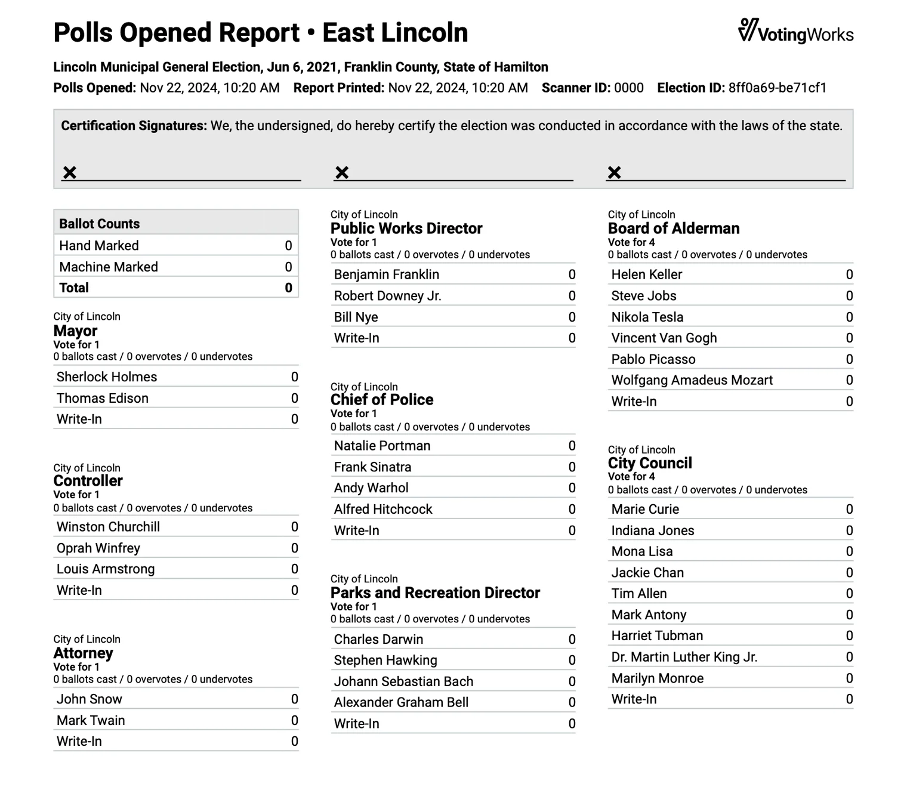

# Open/Close Polls

## Open Polls on VxMark

After VxMark is plugged in, the Polls Closed screen will show.

<figure><figcaption></figcaption></figure>


If there is an orange banner that says "Test Ballot Mode" on the screen, contact your election administrator immediately to prepare the machine for the election.


**To open the polls:**

* [ ] insert the Poll Worker Card into the card reader
* [ ] select _`Open Polls`_
* [ ] confirm by selecting _`Open Polls`_ again
* [ ] remove the Poll Worker Card from VxMark

<figure><figcaption>
insert Poll Worker Card
</figcaption></figure>

 

<figure><figcaption>
select Yes, Open the Polls
</figcaption></figure>

 

<figure><figcaption>
select, Open Polls
</figcaption></figure>

The polls are now open and the VxMark is ready for voters. The number of ballots printed should be zero. Verify the precinct name and election date are correct in the bottom left corner.

## Close Polls on VxMark

* [ ] remove ballot bin seal
* [ ] remove ballots inside (secure or tabulate as required)

<figure><figcaption>
remove ballot bin seal
</figcaption></figure>

* [ ] insert Poll Worker Card
* [ ] select _`View More Actions`_
* [ ] select _`Close Polls`_
* [ ] confirm by selecting, _`Close Polls`_

<figure><figcaption></figcaption></figure>

 

<figure><figcaption></figcaption></figure>

 

<figure><figcaption></figcaption></figure>

* [ ] remove the Poll Worker Card from VxMark

The polls are now closed.

## Pause or Resume Voting

The _`Pause Voting`_ action in the poll worker actions screen is generally used by jurisdictions conducting early voting over multiple days or during an emergency situation. To pause voting and not allow ballots to be marked by VxMark:

* [ ] insert a Poll Worker Card&#x20;
* [ ] select _`View More Actions`_
* [ ] select _`Pause Voting`_
* [ ] confirm by selecting _`Pause Voting`_

<figure><figcaption></figcaption></figure>

 

<figure><figcaption></figcaption></figure>

 

<figure><figcaption></figcaption></figure>

* [ ] remove the Poll Worker Card from VxMark. The polls are now paused.&#x20;

<figure><figcaption></figcaption></figure>

To resume voting:

* [ ] insert a Poll Worker Card&#x20;
* [ ] select View More Actions
* [ ] select _`Resume Voting`_

<figure><figcaption></figcaption></figure>

 

<figure><figcaption></figcaption></figure>

 

<figure><figcaption></figcaption></figure>

* [ ] remove the Poll Worker Card from VxMark. The polls are now open.&#x20;

### Hash Validation

VotingWorks equipment provides additional system security by allowing you to confirm the software is the same as the certified version. To confirm on VxMark, insert a Poll Worker Card and select _`Hash Validation`_. Then navigate to check.voting.works on your phone and scan the QR code on the VxMark. The site will validate the QR code data and verify the machine and software.

<figure><figcaption></figcaption></figure>

 

<figure><figcaption></figcaption></figure>


If the hash is not validated at check.voting.works contact your election administrator immediately.

