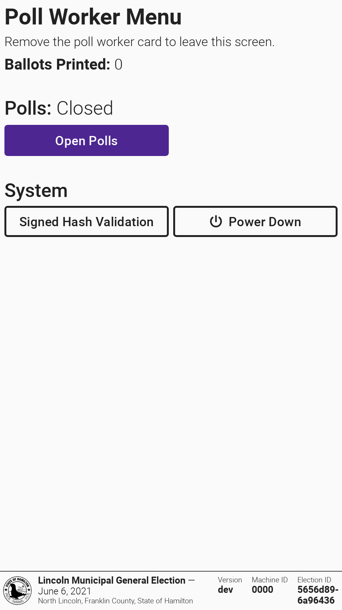

# Packing Up VxMark

## VxMark Pack Up

First, power down VxMark with the `Power Down` button in the poll worker menu:

<figure><figcaption></figcaption></figure>

Then, pack up VxMark:

* [ ] Unplug the VxMark power cable from the outlet
* [ ] Unplug the headphones from the accessible controller
* [ ] Collapse the headphones and wrap the headphone cord around it
* [ ] Place the headphones in the bin to the left of the screen and close it
* [ ] Place the accessible controller in its place to the right of the screen, pushing the cable beneath it

<figure><figcaption></figcaption></figure> <figure><figcaption></figcaption></figure>

* [ ] Rotate the screen counterclockwise 90°, and then tilt it back into the case
* [ ] Close the lid of the case and latch it shut

<figure><figcaption></figcaption></figure> <figure><figcaption></figcaption></figure>

* [ ] Unplug the printer cable from the printer
* [ ] Tilt the case on its front to access the back compartment
* [ ] Neatly bundle the power and printer cables together and place the bundle in the back compartment
* [ ] Close the back compartment
* [ ] Seal VxMark per your jurisdiction's processes

## Printer Pack Up

* [ ] Turn off the printer by pressing the power button on the front

<figure><figcaption></figcaption></figure>

* [ ] Unplug the power cable from the outlet and the printer
* [ ] Place the printer into its case

<figure><figcaption></figcaption></figure>

* [ ] Place the power cable into the case atop the printer
* [ ] Close the printer case
* [ ] Seal the printer case per your jurisdiction's processes
