# Voting Session Language & Accessibility Settings

Voters have a number of options to change the VxMarkScan interface to suit their individual needs.

<figure>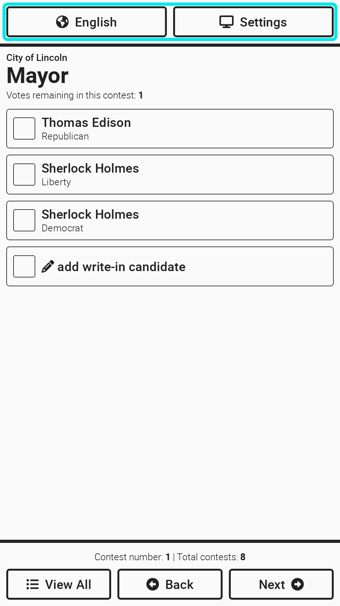<figcaption></figcaption></figure>

## Ballot Language

To change the language from English to another language select `English` at the top of the screen. Additional language buttons will display, select the preferred language and then select `Done`.

<figure>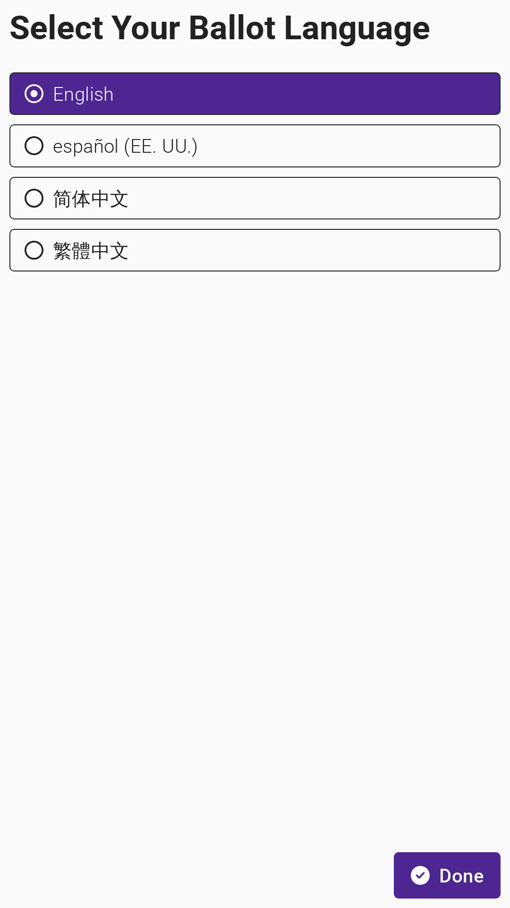<figcaption></figcaption></figure>

## Visual Settings

### Text and Screen Color

Four different color options are available for users. While we provide a short description of who may benefit most from these different options, please note that the user likely knows what setting is best for their disability.

**White text, black background** - used by a person that finds white backgrounds too bright due to visual disabilities. May also be easier to read when room lighting causes a glare on the screen.

**Gray text, dark background** - used by a person needing lower contrast. For example, a person with dyslexia may find the screen quieter.

**Dark text, light background** - as the default this setting will be used by most people.

**Black text, white background** - used by people who need the highest contrast because of light vision or color perception disabilities or aging.

<figure>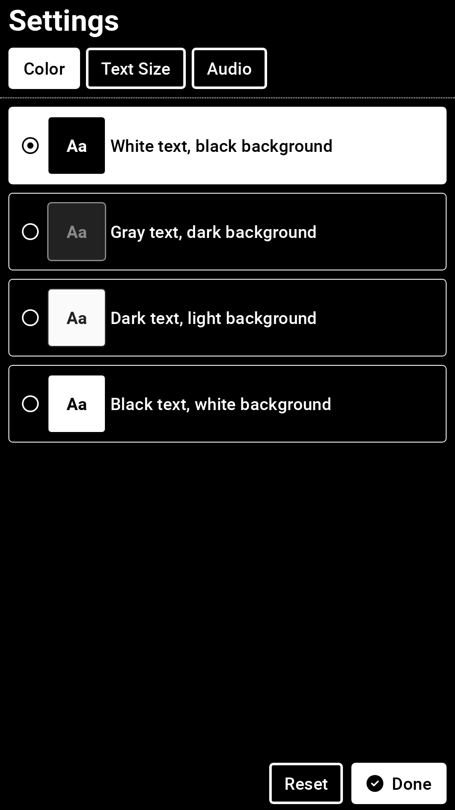<figcaption></figcaption></figure> <figure>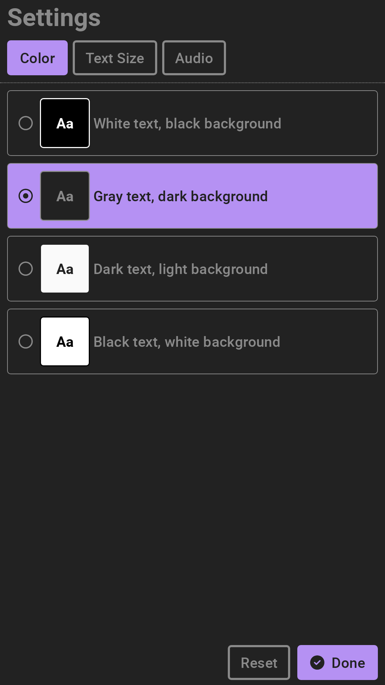<figcaption></figcaption></figure> <figure>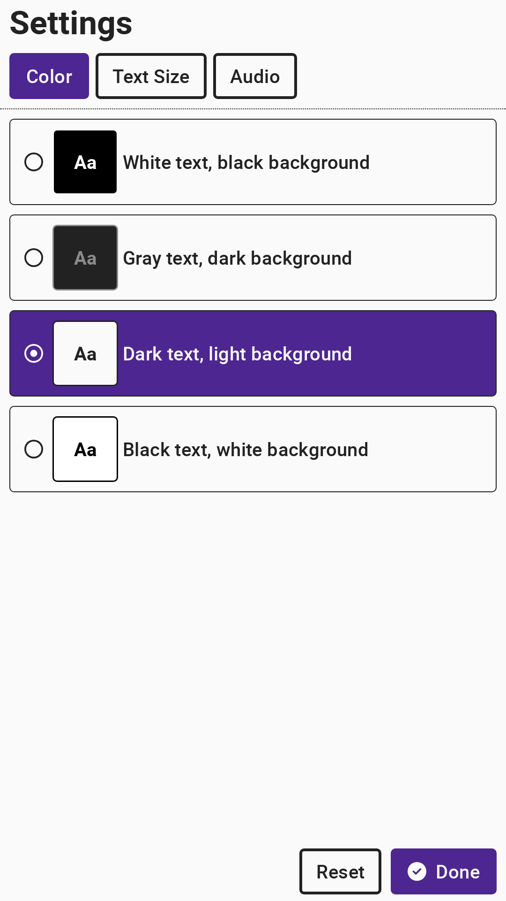<figcaption></figcaption></figure> <figure>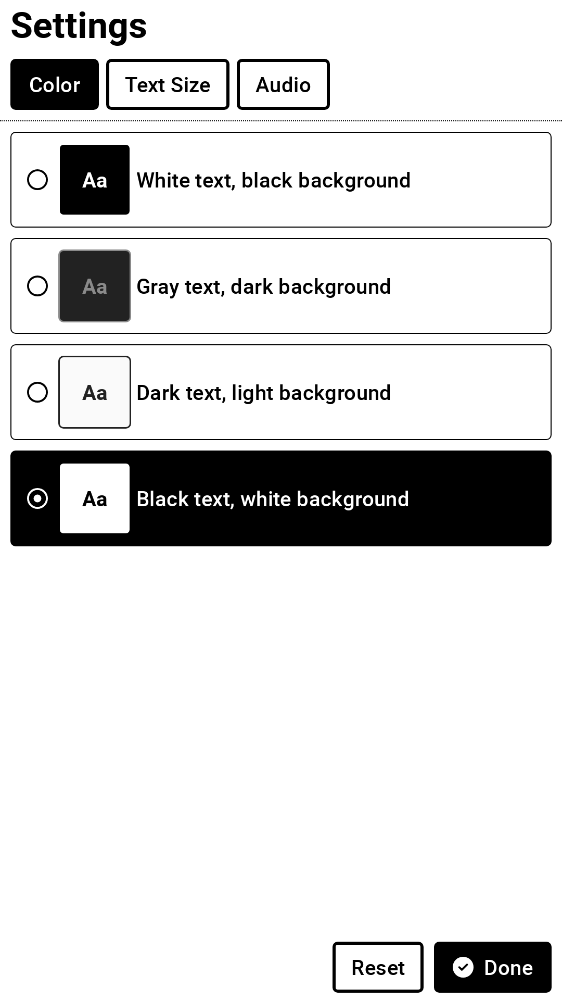<figcaption></figcaption></figure>

### Text Size

The default text size is `Medium`. A user can select `Small`, `Large`, or `Extra-Large` based on their preferences. Select `Done` to save the selection.

<figure>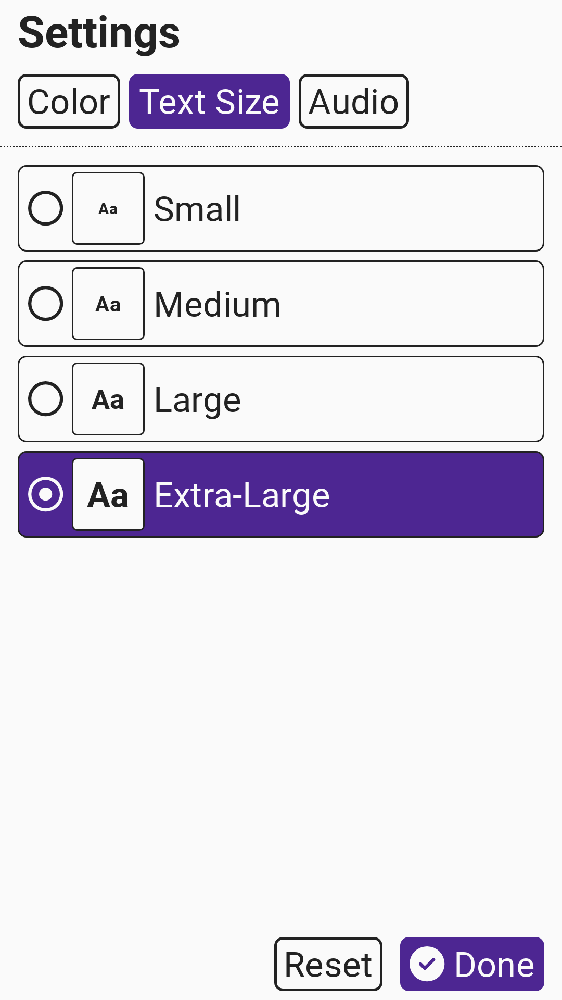<figcaption></figcaption></figure> <figure>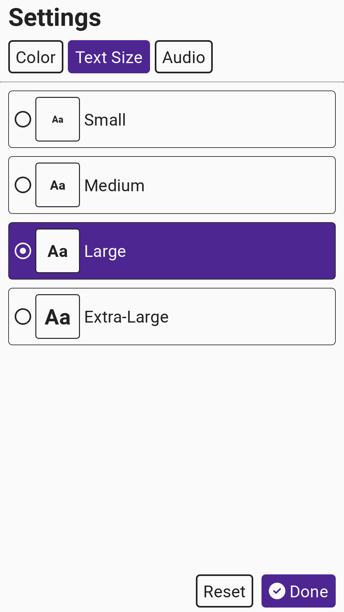<figcaption></figcaption></figure> <figure>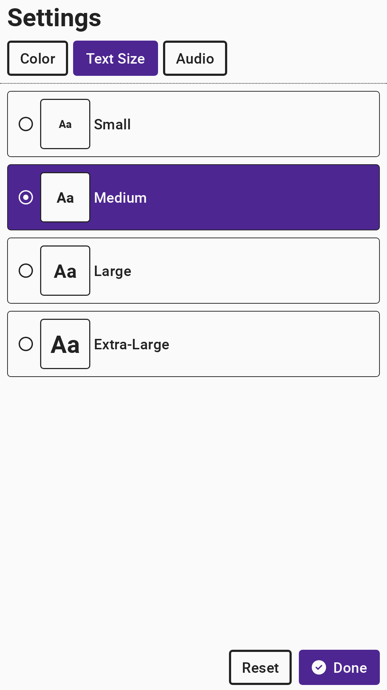<figcaption></figcaption></figure> <figure>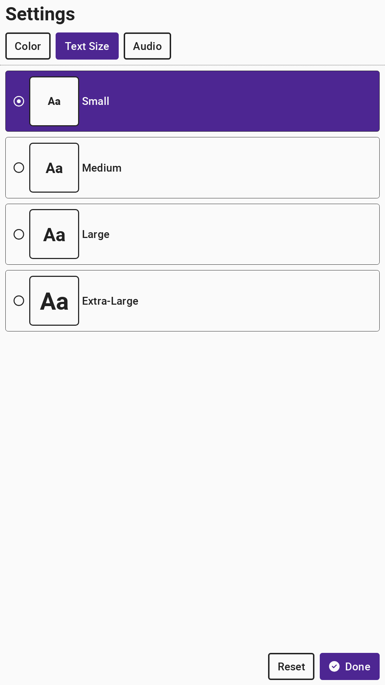<figcaption></figcaption></figure>

## Audio Settings

Audio is always defaulted to on when headphones are plugged in. Instructions for all steps of the voting session are read to the user in audio format and all ballot content is read when navigated to by the user.

Select `Mute Audio` to mute all sound. Select `Enable Audio-Only Mode` to hide the screen. Voters using only audio to navigate through the ballot may want to hide the screen for privacy. Additionally, a voter who has a T-coil neckloop may unplug the headphones and plug that device into the headphone jack.

Headphones should be sanitized after a voting session using the audio-tactile interface. To do so, simply discard the headphone ear covers and replace with a new set of ear covers. Disposable ear covers suitable for VxMarkScan are listed in the [supply-list.md](../miscellaneous/supply-list.md "mention").

<figure>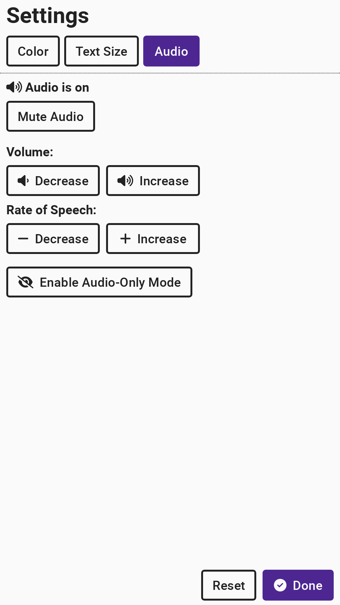<figcaption></figcaption></figure> <figure>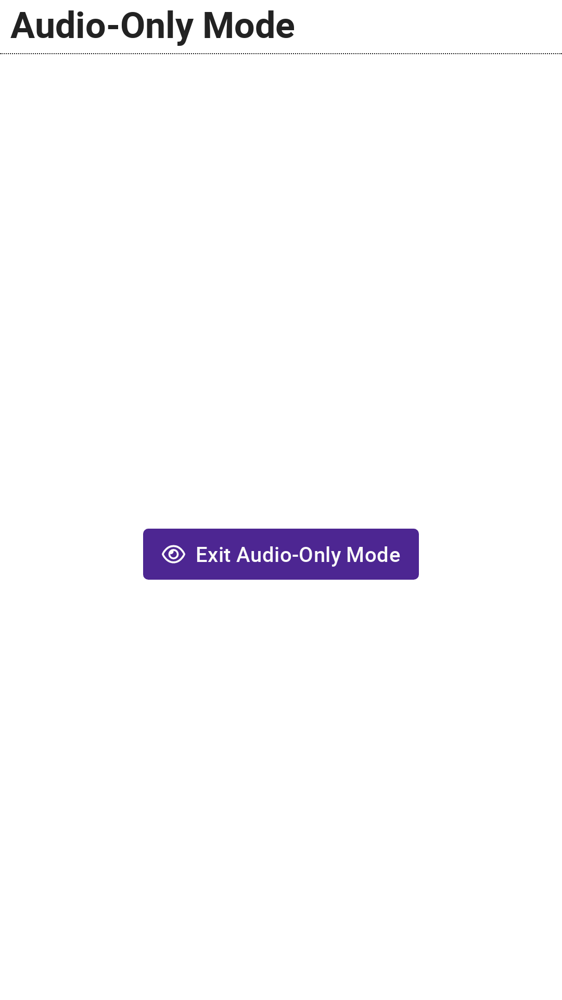<figcaption></figcaption></figure>


All selections above are made for a specific voting session and will reset with the next voter.


## PAT Settings

VxMarkScan has a PAT (personal assistive technology) input port into which a user can plug in a dual-switch input such as a sip-and-puff device. When a PAT input is attached during a voting session, VxMarkScan will enter a calibration flow where the voter will map their two inputs to "move" and "select." After calibration, a voter can access all VxMarkScan functionality throughout the voting session.
