# Voting Sessions

### Activating a Voting Session


A voter may bring their own Personal Assistive Technology (PAT) device (ex. jelly bean switch, sip and puff device, etc.) or headphones. It must have a 3.5mm plug or connector. Once plugged in, a test screen will pop up to assist in configuration. See [System Administrator Functions & System Diagnostics ](../vxmarkscan/diagnostics.md)for instructions.


If a voter chooses to use VxMarkScan:

* [ ] Insert a poll worker card into the card reader beneath the accessible controller
* [ ] Select the voter's ballot style

<figure>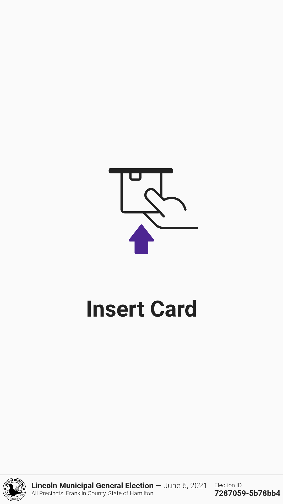<figcaption></figcaption></figure> <figure>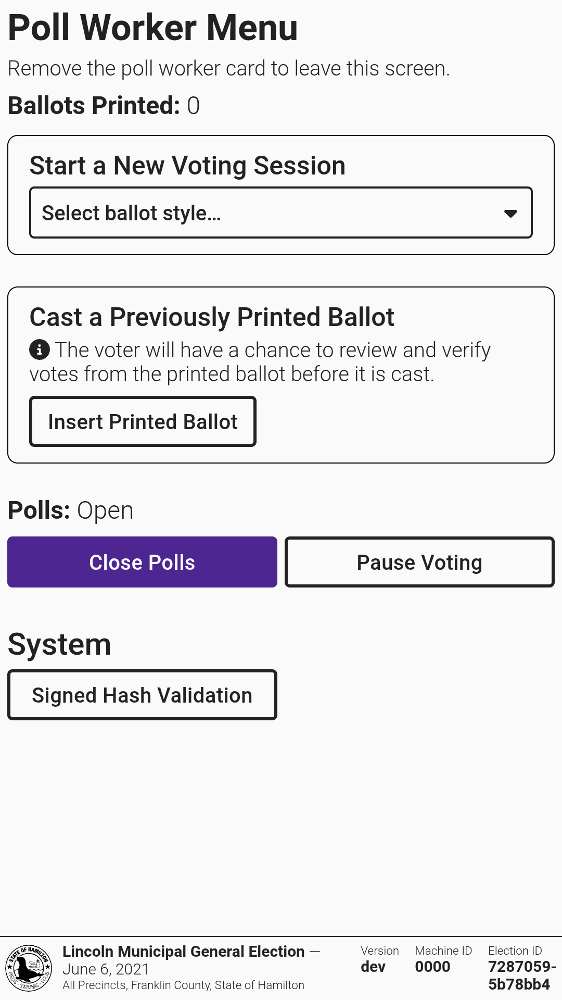<figcaption></figcaption></figure> <figure>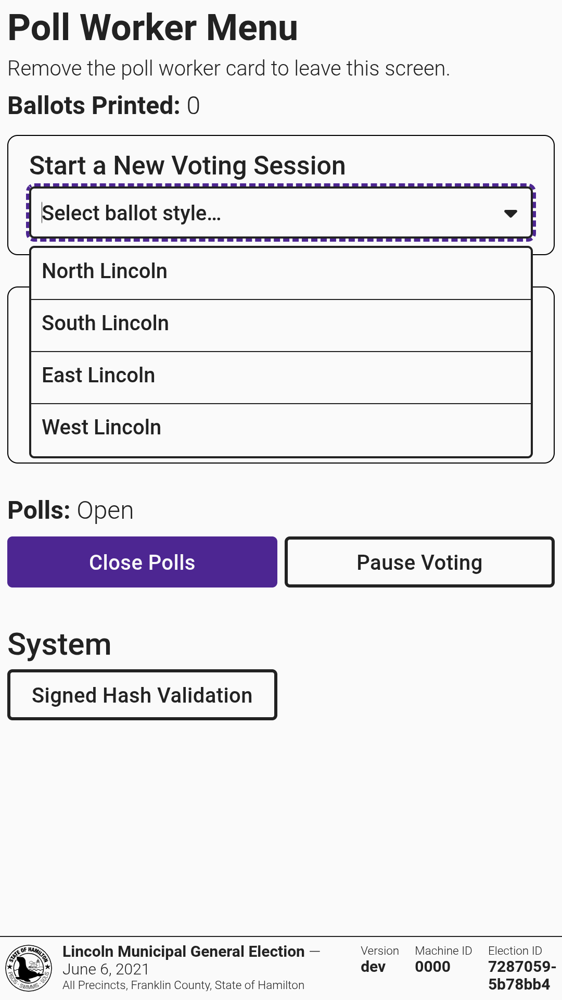<figcaption></figcaption></figure>

* [ ] When prompted, feed one sheet of paper into the front input tray
* [ ] Once loaded, the screen will show that the voting session is active
* [ ] Review the precinct and ballot style to ensure it was selected correctly for the voter
* [ ] Remove the poll worker card

<figure>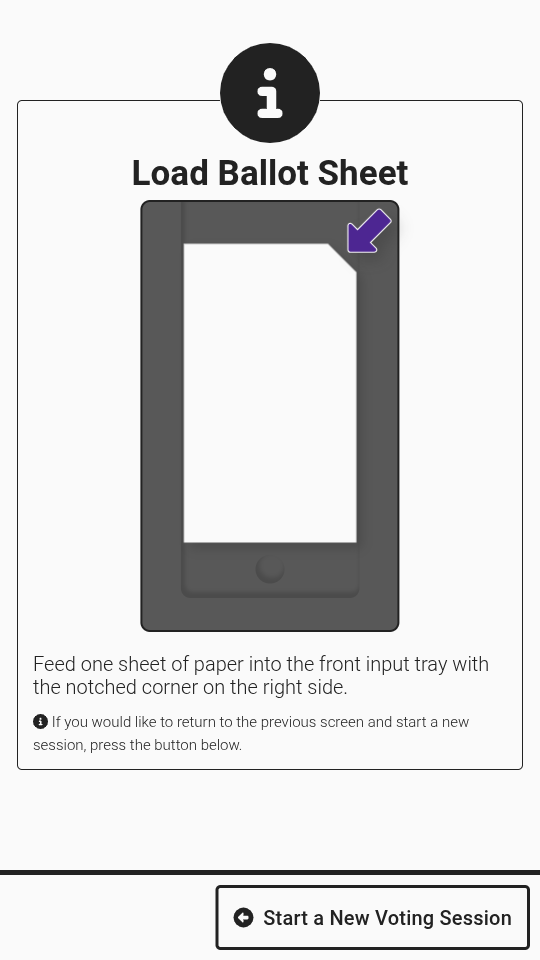<figcaption></figcaption></figure> <figure>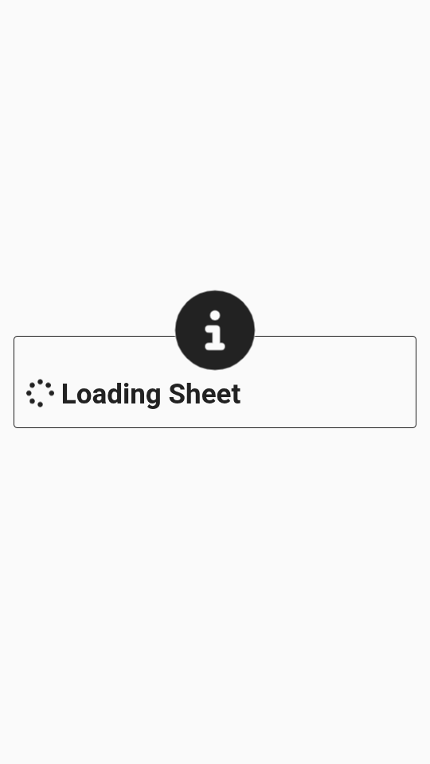<figcaption></figcaption></figure> <figure>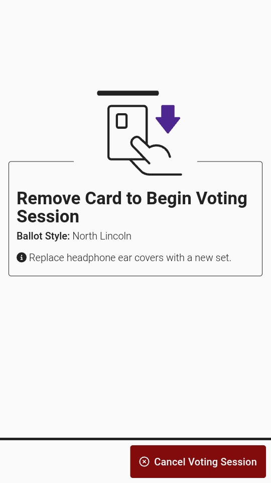<figcaption></figcaption></figure>


If the wrong ballot style or precinct was selected, insert the poll worker card (if not already inserted) and select _`Cancel Voting Session`_ to return to the poll worker menu.


### Marking a Ballot

Let the voter know they can begin voting by selecting _`Start Voting`_.

One contest will display at a time. The voter will select the candidate(s) of their choice. The voter moves to the next contest by selecting _`Next`_. The voter can skip a contest by selecting _`Next`_ without making a selection. To return to a previous contest, select _`Back`_. A _`More`_ button will display if there are more candidates or text than fit on a single screen.

<figure>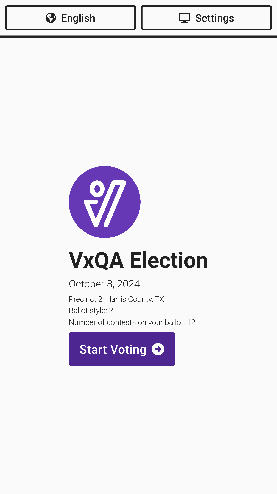<figcaption></figcaption></figure> <figure><figcaption></figcaption></figure> <figure>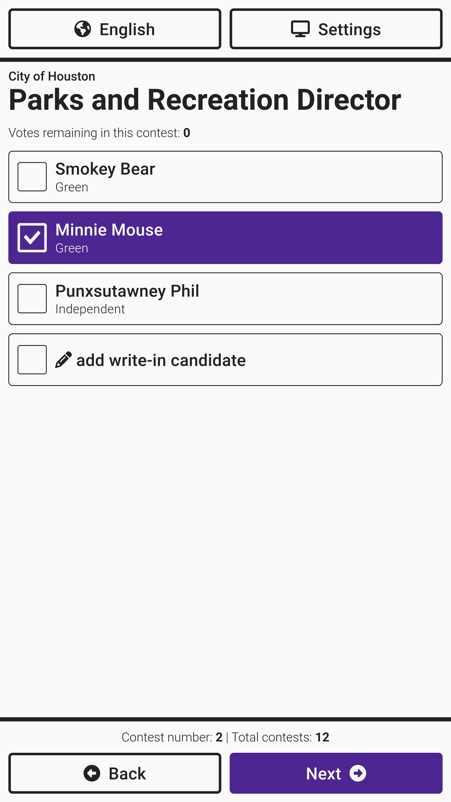<figcaption></figcaption></figure>


If a voter would like to change a selection, they must first deselect a candidate previously selected.


### Entering a Write-In

To enter a write-in candidate, select _`add write-in candidate`_ and use the keyboard to type in the candidate's name. Select _`Accept`_ when finished.

<figure><figcaption></figcaption></figure> <figure>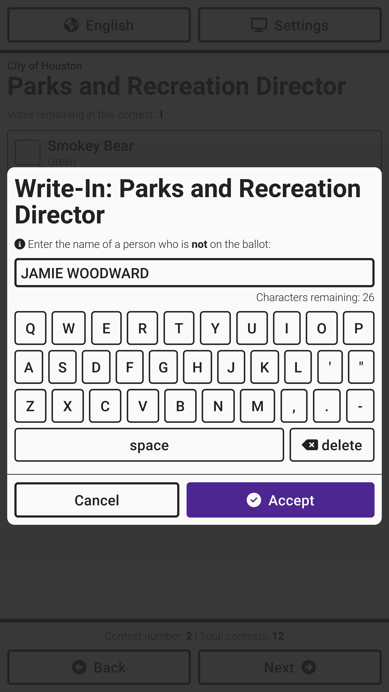<figcaption></figcaption></figure> <figure>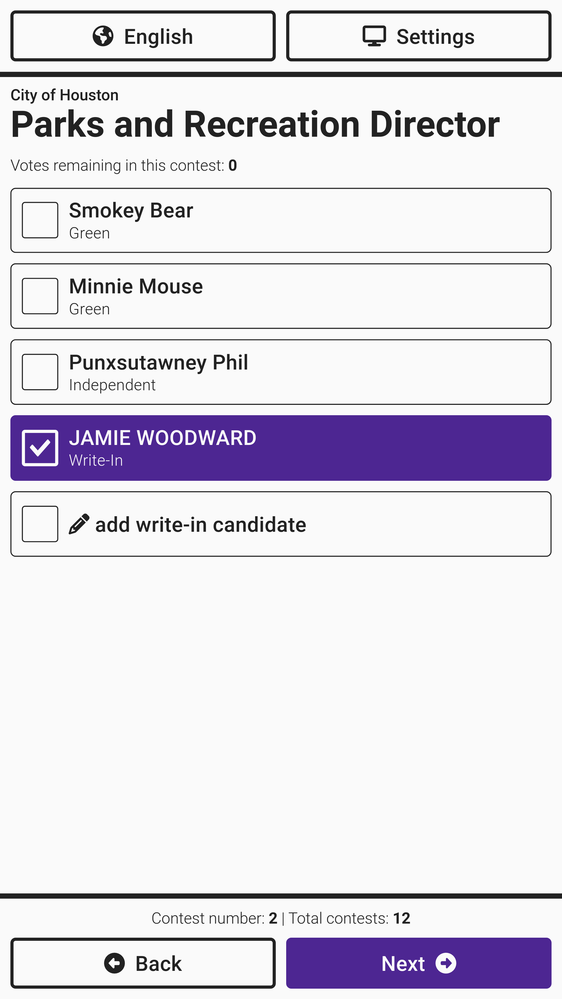<figcaption></figcaption></figure>

### Reviewing Votes

After working through all contests, a _Review Your Votes_ screen appears that allows the voter to change any vote by selecting _`Change`_. Once selections have been reviewed, select _`Print My Ballot`_. The ballot will print and be displayed for review. The final _Review Your Votes_ screen is displayed to compare the official ballot selections with the screen. Select _`Cast My Ballot`_ to cast the ballot.

<figure>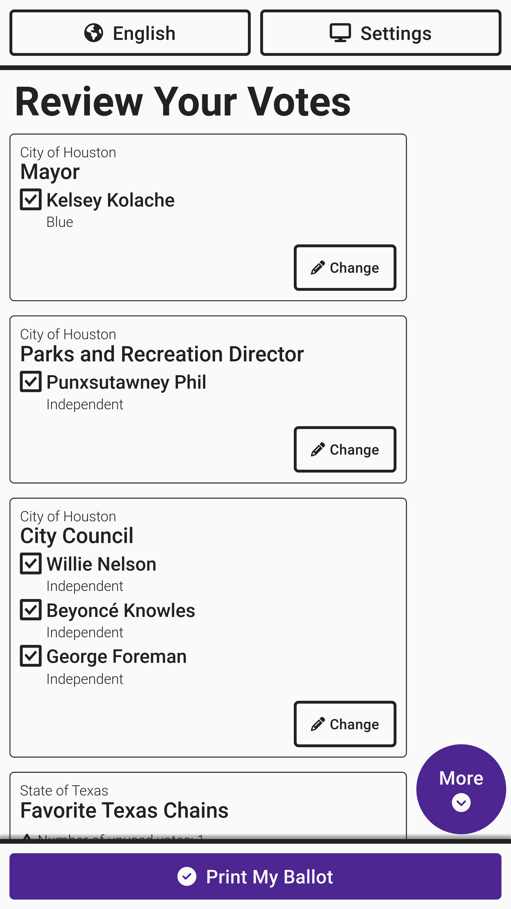<figcaption></figcaption></figure> <figure>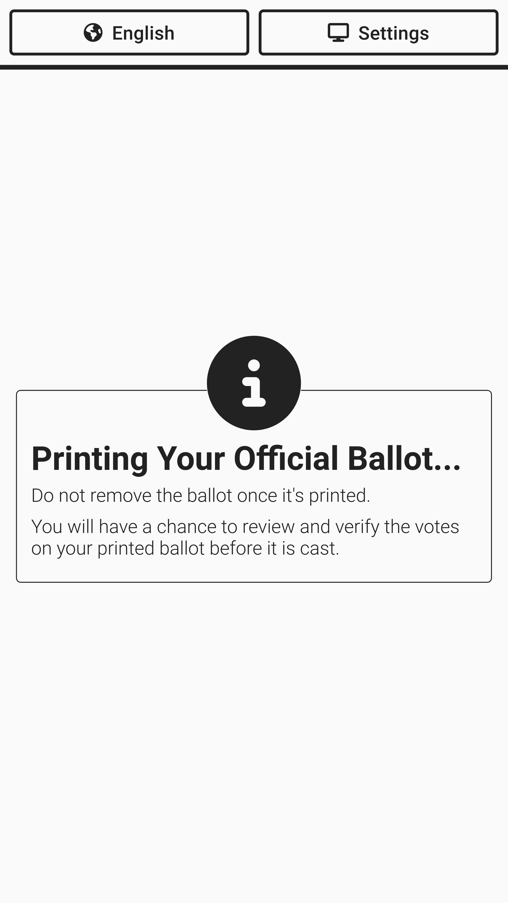<figcaption></figcaption></figure> <figure>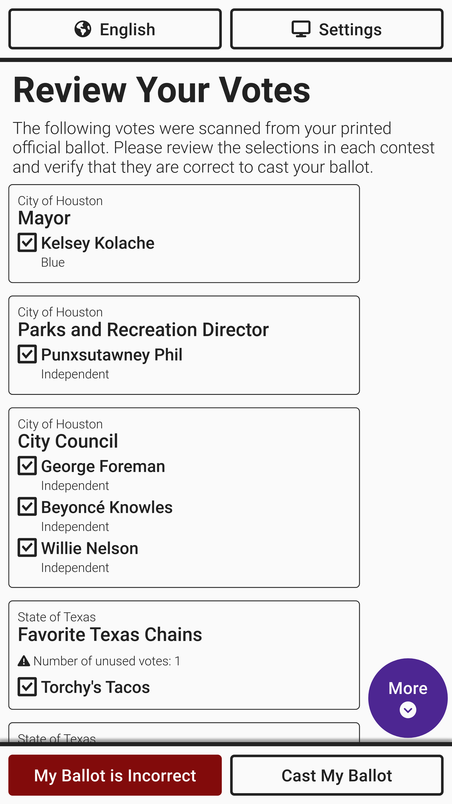<figcaption></figcaption></figure>


If the voter removes the ballot from the printer to review, the VxMarkScan will ask if they are still voting. They should reload their ballot to cast the ballot. If the ballot is not reloaded, the VxMarkScan will clear the ballot after five minutes of inactivity.


The screen will show the ballot being cast and verify it was cast and dropped into the ballot bin.

<figure><figcaption></figcaption></figure> <figure>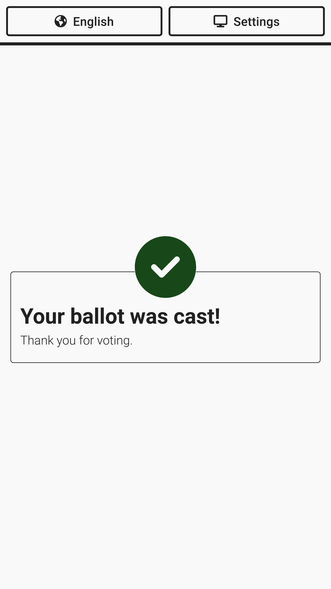<figcaption></figcaption></figure>


If headphones are used, using earpad covers and replacing after use is recommended. See the [Supply List](../miscellaneous/supply-list.md) for more information.

