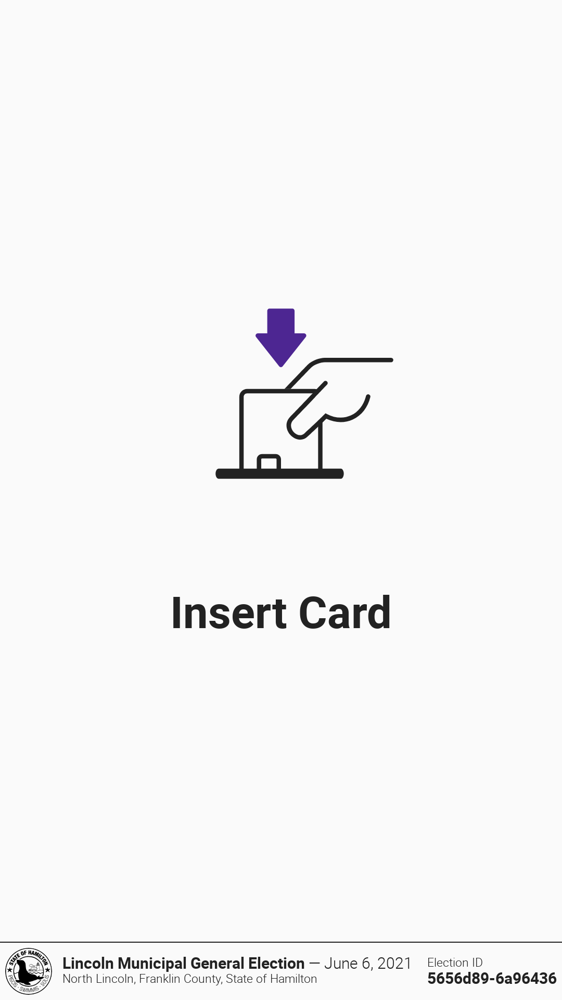
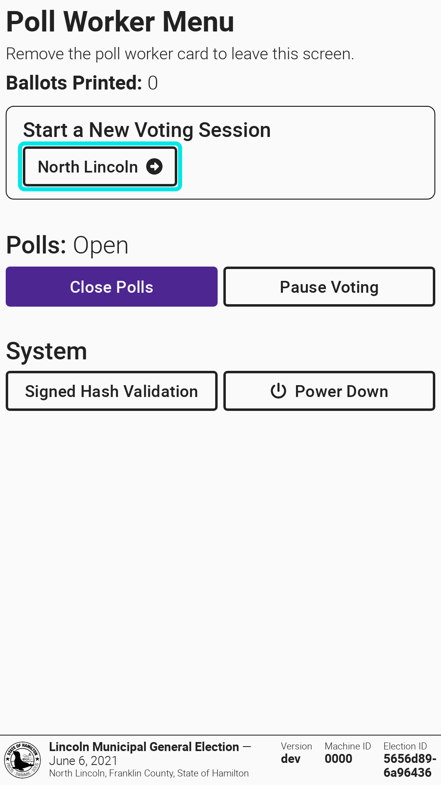
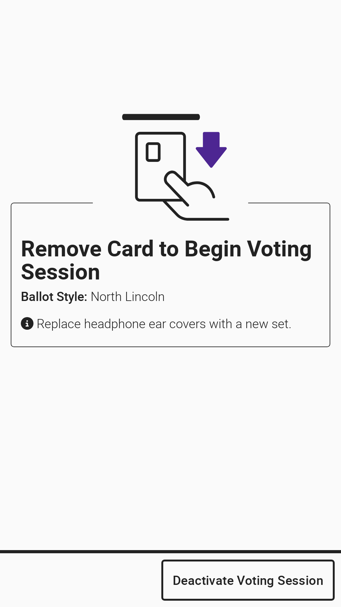
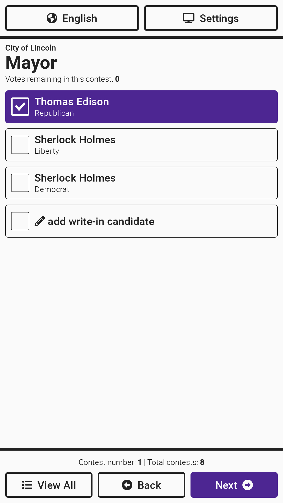
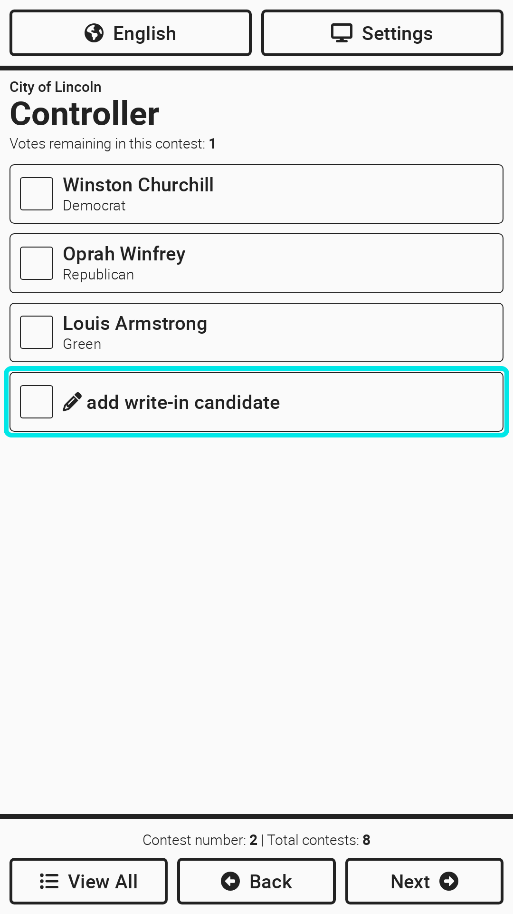
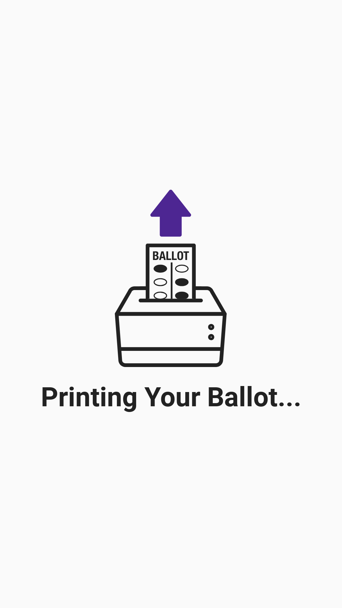
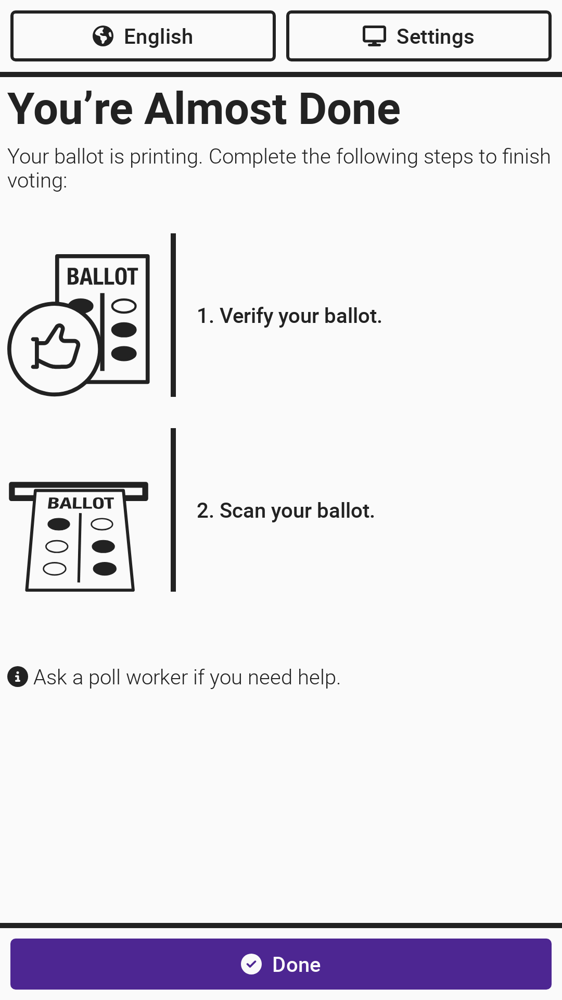

# Voting Sessions

## Activating a Voting Session


A voter may bring their own Personal Assistive Technology (PAT) device (ex. jelly bean switch, sip and puff device, etc.) or headphones. It must have a 3.5mm plug or connector. Once plugged in, a test screen will pop up to assist in configuration. See [System Administrator Functions & System Diagnostics ](../vxmarkscan/diagnostics.md)for instructions.




In order to start a new voting session on VxMark:

* [ ] insert a poll worker card into the card reader in the back right
* [ ] select the voter's ballot style
* [ ] remove the poll worker card to begin the voting session

<figure><figcaption></figcaption></figure> <figure><figcaption></figcaption></figure> <figure><figcaption></figcaption></figure>


If the wrong ballot style or precinct was selected, insert the poll worker card (if not already inserted) and select `Deactivate Voting Session` to return to the poll worker menu.


## Marking a Ballot

Let the voter know they can begin voting by selecting `Start Voting`.

One contest will display at a time. The voter will select the candidate(s) of their choice. The voter moves to the next contest by selecting `Next`. The voter can skip a contest by selecting `Next` without making a selection.  To return to a previous contest, select `Back`.  A `More` button will display if there are more candidates or text than fit on a single screen.

<figure><figcaption></figcaption></figure> <figure><figcaption></figcaption></figure>


If a voter would like to change a selection, they must first deselect a candidate previously selected.


## Entering a Write-In

To enter a write-in candidate, select `add write-in candidate` and use the keyboard to type in the candidate's name. Select `Accept` when finished.&#x20;

<figure><figcaption></figcaption></figure> <figure><figcaption></figcaption></figure> <figure><figcaption></figcaption></figure>

## Reviewing Votes

After working through all contests, a _Review Your Votes_ screen appears that allows the voter to change any vote by selecting `Change`. Once selections have been reviewed, select `Print My Ballot`. After the ballot prints, the voter should retrieve and review the printed ballot.

<figure><figcaption></figcaption></figure> <figure><figcaption></figcaption></figure> <figure><figcaption></figcaption></figure>


If the voter wants to make changes to their ballot after it has printed, they will have to complete a new voting session. The previous ballot must be spoiled.

