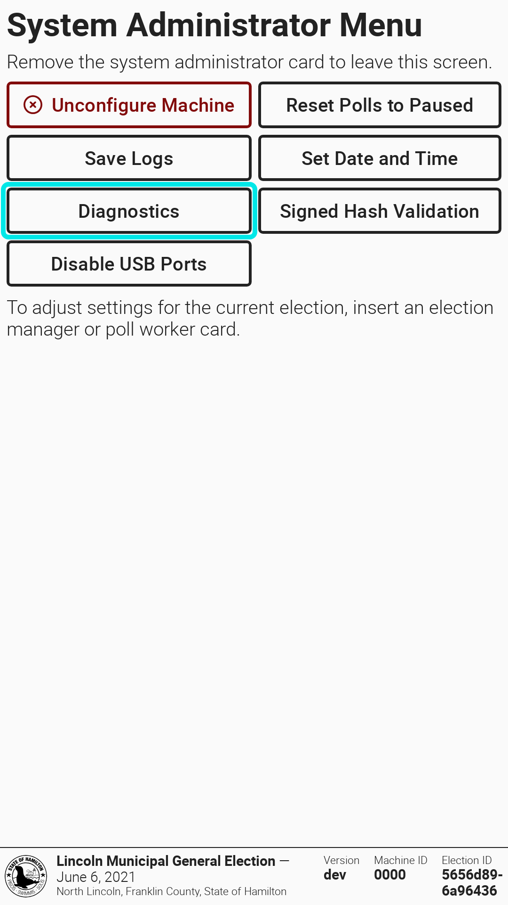
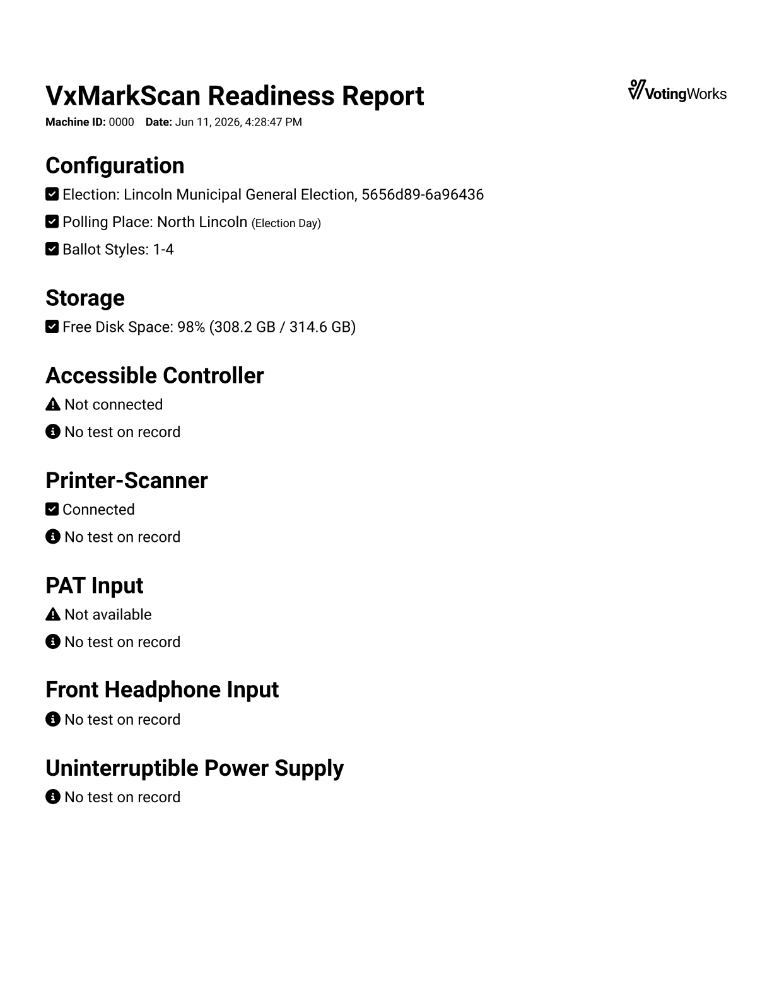

# VxMarkScan Diagnostics

In preparation for an election or in response to issues, the diagnostics interface can help verify VxMarkScan is functioning as expected or pinpoint problems that do arise. Both election managers and system administrators can access the diagnostic interface.

<figure><figcaption></figcaption></figure> <figure><figcaption></figcaption></figure>

The diagnostics screen shows information about how the machine is configured, how much storage is left on the device, and the current status of the hardware. There are tests for the accessible controller, front headphone input, PAT device input, uninterruptible power supply, and printer-scanner

<figure><figcaption></figcaption></figure>

For each component test, simply select `Test [Component]` and follow the instructions on the screen. The results of the most recent test are displayed on the diagnostics screen.


If the headphone or PAT test fails, try to unplug and replug the device and try again. If any test continues to fail, restart VxMarkScan and try again.


### Readiness Report

The readiness report can be used as a record of system diagnostic verification. Select `Save Readiness Report` to save a copy to a USB drive.

<figure><figcaption>
Example VxMarkScan Readiness Report
</figcaption></figure>
