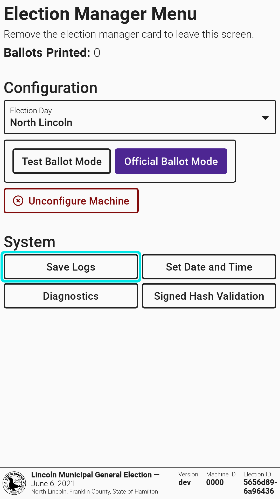
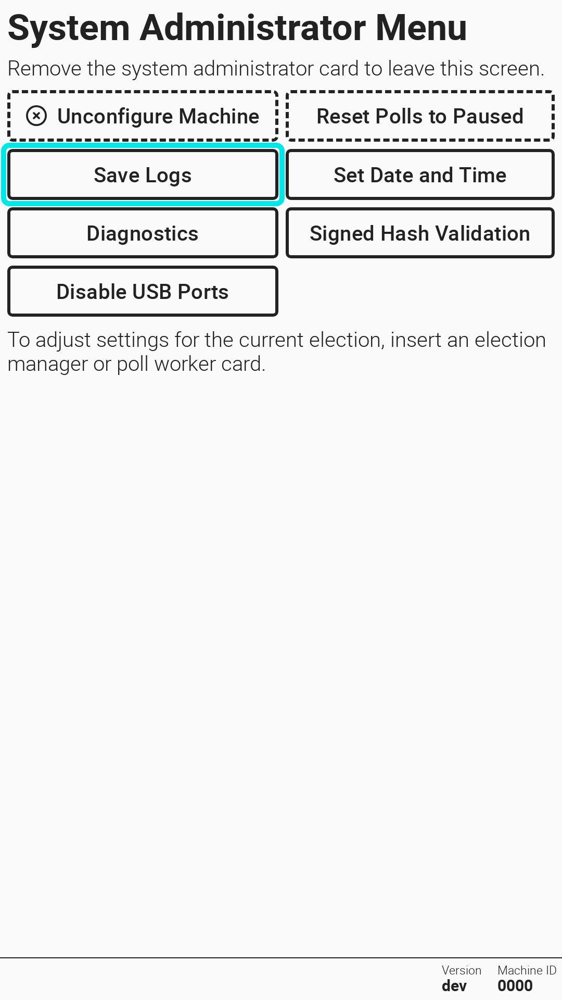

# Retaining and Removing Files - VxMarkScan

VxMarkScan does not retain any type of ballot or voter data so the only files to retain after an election are the logs. Logs are saved in the `/logs` folder on the USB drive. To save logs, insert a USB drive, then insert an election manager or system administrator card, and select `Save Logs`.

<figure><figcaption></figcaption></figure> <figure><figcaption></figcaption></figure>

To remove the election definition from VxMarkScan, select `Unconfigure Machine` from the election manager or system administrator menu and confirm by selecting `Delete All Election Data`.
