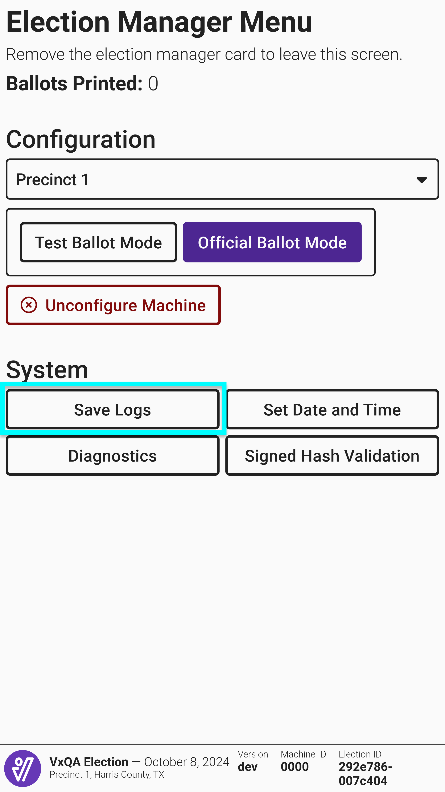

# Retaining and Removing Files - VxMarkScan

### VxMarkScan Log Files

VxMarkScan does not retain any type of ballot or voter data so the only files to retain after an election are the logs. Logs are saved in the /logs folder on the USB drive. To save logs, insert a USB drive, then insert an election manager or system administrator card, and select _`Save Logs`_.

<figure><figcaption></figcaption></figure> <figure><figcaption></figcaption></figure>

To remove the election definition from VxMarkScan, select _`Unconfigure Machine`_ from the election manager or system administrator menu and confirm by selecting _`Delete All Election Data`_.&#x20;

