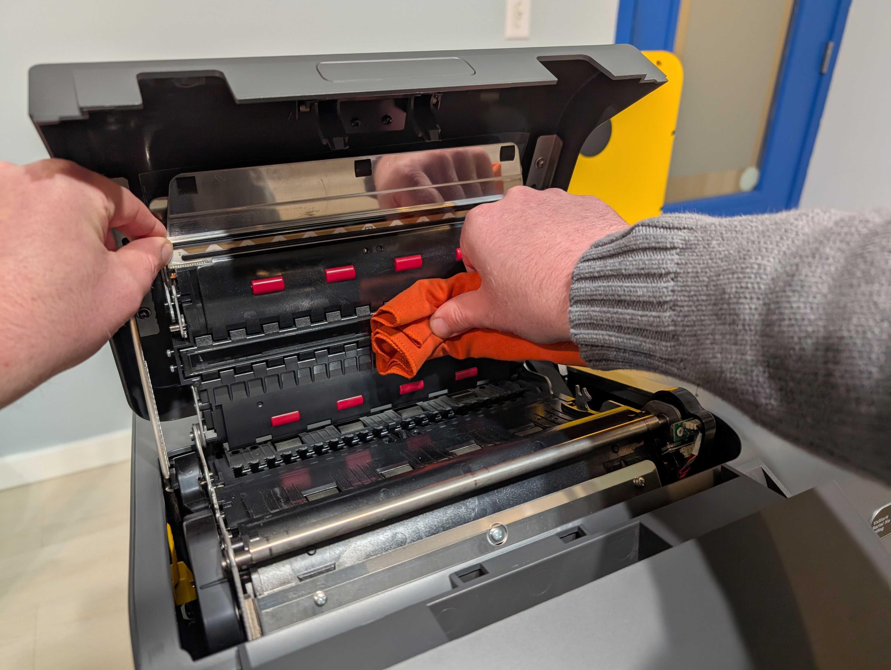

# VxMarkScan Hardware Setup

## VxMarkScan Setup

Part of the Precinct System, VxMarkScan is an accessible ballot marking device that gives voters the ability to mark their choices and print their ballot from a touchscreen.

**VxMarkScan** can be set up through the following steps:

**Set up the stand**:

* [ ] With the legs facing up, raise a leg until it snaps in place
* [ ] Continue until all legs are raised
* [ ] Flip the stand up right

<figure><figcaption>
Raise leg to snap in place
</figcaption></figure> <figure><figcaption></figcaption></figure> <figure><figcaption>
All legs in place
</figcaption></figure>

* [ ] Snap the support bar in place on the back two legs

<figure><figcaption>
Support bar
</figcaption></figure> <figure><figcaption>
Snap support bar to back legs
</figcaption></figure> <figure><figcaption>
Support bar installed
</figcaption></figure>

* [ ] Add power block holder to the back center on the top of the stand
* [ ] Insert power block into the holder so cords lay out each side

<figure><figcaption>
Add power block holder
</figcaption></figure> <figure><figcaption>
Insert power block into the holder
</figcaption></figure> <figure><figcaption>
Power block and holder installed
</figcaption></figure>

**Set up the ballot marking device:**

* [ ] Using two people, lift and place the ballot marking device on the stand by aligning the stand bars with the bottom

<figure><figcaption>
Ballot marking device
</figcaption></figure> <figure><figcaption>
Place ballot marking device on the stand
</figcaption></figure>

* [ ] Plug in the power cord connector to the back of the ballot marking device
* [ ] Plug the power cord into the APC UPS battery backup

<figure><figcaption>
Power cord connector
</figcaption></figure> <figure><figcaption>
Power cord connector plugged in
</figcaption></figure> <figure><figcaption>
Power plug
</figcaption></figure> <figure><figcaption>
Power cord plugged in
</figcaption></figure>

* [ ] Push the printer-scanner cover release button in
* [ ] Open the printer-scanner cover
* [ ] Slide the ballot bin into place
* [ ] Close the printer-scanner cover
* [ ] Document and seal the ballot bin (loop on right side) as required

<figure><figcaption>
Push the printer cover button
</figcaption></figure> <figure><figcaption>
Open the printer cover
</figcaption></figure> <figure><figcaption>
Ballot bin
</figcaption></figure> <figure><figcaption>
Slide ballot bin into place
</figcaption></figure> <figure><figcaption>
Document and seal as required
</figcaption></figure>

* [ ] Place the privacy shield pegs in the holes on each side of the ballot marking device

<figure><figcaption>
Privacy shield pegs
</figcaption></figure> <figure><figcaption>
Privacy shield holes
</figcaption></figure> <figure><figcaption>
Privacy shield installed
</figcaption></figure>

* [ ] Plug the headphones into the front headphone jack
* [ ] Push the power button to turn VxMarkScan on

<figure><figcaption>
Plug the headphones in
</figcaption></figure> <figure><figcaption>
Push the power button to turn on
</figcaption></figure>

The VxMarkScan is set up.



## Cleaning VxMarkScan

The scanner should be cleaned for every election with scanner cleaning solution (see [supply-list.md](../miscellaneous/supply-list.md "mention")) and a lint-free or microfiber cloth.

* [ ] Press printer cover button to open printer cover
* [ ] Open scanner by lifting the metal piece above the green sticker
* [ ] Apply cleaning solution to cloth and wipe the inside of the scanner with moderate force
  * [ ] Clean scanner glass
  * [ ] Clean rollers
* [ ] Close scanner by pressing down on the green sticker until the scanner clicks into place
* [ ] Close printer cover until it clicks into place

<figure><figcaption></figcaption></figure>
