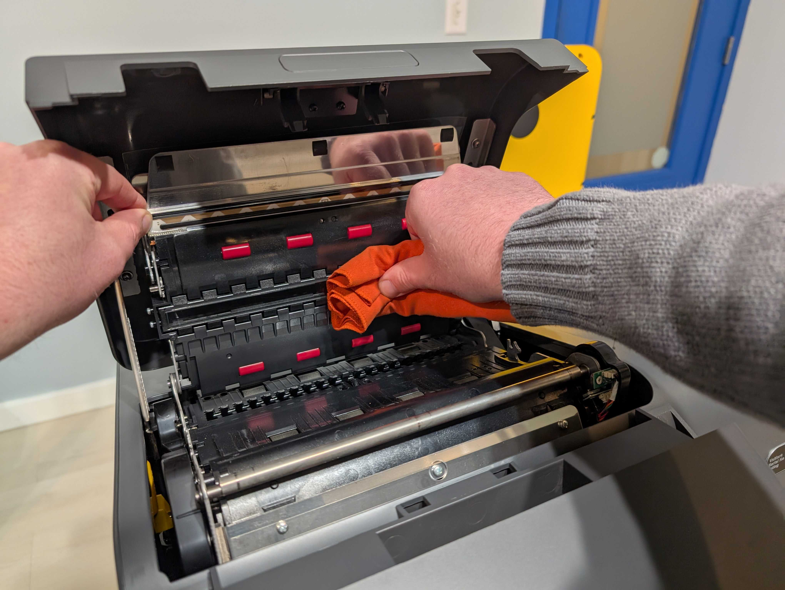

# VxMarkScan Hardware Setup

## VxMarkScan Setup

Part of the Precinct System, VxMarkScan is an accessible ballot marking device that gives voters the ability to mark their choices and print their ballot from a touchscreen.

**VxMarkScan** can be set up through the following steps:

**Set up the stand**:

* [ ] with the legs facing up, raise a leg until it snaps in place
* [ ] continue until all legs are raised
* [ ] flip the stand up right

<figure><figcaption>
raise leg to snap in place
</figcaption></figure> <figure><figcaption></figcaption></figure> <figure><figcaption>
all legs in place
</figcaption></figure>

* [ ] snap the support bar in place on the back two legs

<figure><figcaption>
support bar
</figcaption></figure> <figure><figcaption>
snap support bar to back legs
</figcaption></figure> <figure><figcaption>
support bar installed
</figcaption></figure>

* [ ] add power block holder to the back center on the top of the stand
* [ ] insert power block into the holder so cords lay out each side

<figure><figcaption>
add power block holder
</figcaption></figure> <figure><figcaption>
insert power block into the holder
</figcaption></figure> <figure><figcaption>
power block and holder installed
</figcaption></figure>

**Set up the ballot marking device:**

* [ ] using two people, lift and place the ballot marking device on the stand by aligning the stand bars with the bottom

<figure><figcaption>
ballot marking device
</figcaption></figure> <figure><figcaption>
place ballot marking device on the stand
</figcaption></figure>

* [ ] plug in the power cord connector to the back of the ballot marking device
* [ ] plug the power cord into the UPS battery backup

<figure><figcaption>
power cord connector
</figcaption></figure> <figure><figcaption>
power cord connector plugged in
</figcaption></figure> <figure><figcaption>
power plug
</figcaption></figure> <figure><figcaption>
power cord plugged in
</figcaption></figure>

* [ ] push the printer-scanner cover release button in
* [ ] open the printer-scanner cover
* [ ] slide the ballot bin into place
* [ ] close the printer-scanner cover
* [ ] document and seal the ballot bin (loop on right side) as required

<figure><figcaption>
push the printer cover button
</figcaption></figure> <figure><figcaption>
open the printer cover
</figcaption></figure> <figure><figcaption>
ballot bin
</figcaption></figure> <figure><figcaption>
slide ballot bin into place
</figcaption></figure> <figure><figcaption>
document and seal as required
</figcaption></figure>

* [ ] place the privacy shield pegs in the holes on each side of the ballot marking device

<figure><figcaption>
privacy shield pegs
</figcaption></figure> <figure><figcaption>
privacy shield holes
</figcaption></figure> <figure><figcaption>
privacy shield installed
</figcaption></figure>

* [ ] plug the headphones into the front headphone jack
* [ ] push the power button to turn VxMarkScan on

<figure><figcaption>
plug the headphones in
</figcaption></figure> <figure><figcaption>
push the power button to turn on
</figcaption></figure>

The VxMarkScan is set up.

## Cleaning VxMarkScan

The scanner should be cleaned for every election with scanner cleaning solution (see [supply-list.md](../miscellaneous/supply-list.md "mention")) and a lint-free or microfiber cloth.&#x20;

* [ ] press printer cover button to open printer cover
* [ ] open scanner by lifting the metal piece above the green sticker
* [ ] apply cleaning solution to cloth and wipe the inside of the scanner with moderate force
  * [ ] clean scanner glass
  * [ ] clean rollers
* [ ] close scanner by pressing down on the green sticker until the scanner clicks into place
* [ ] close printer cover until it clicks into place

<figure><figcaption></figcaption></figure>

