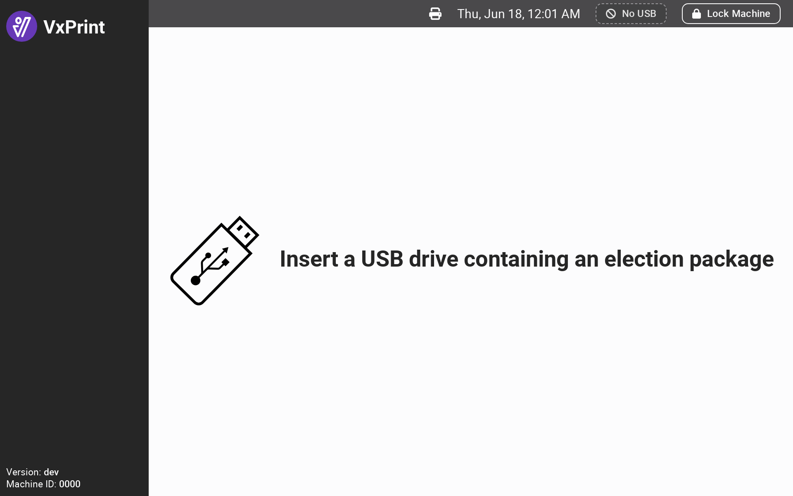
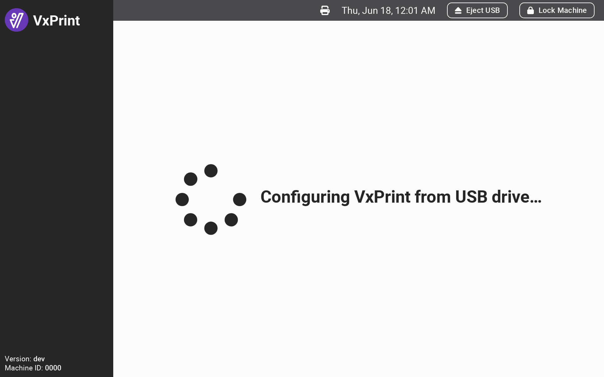
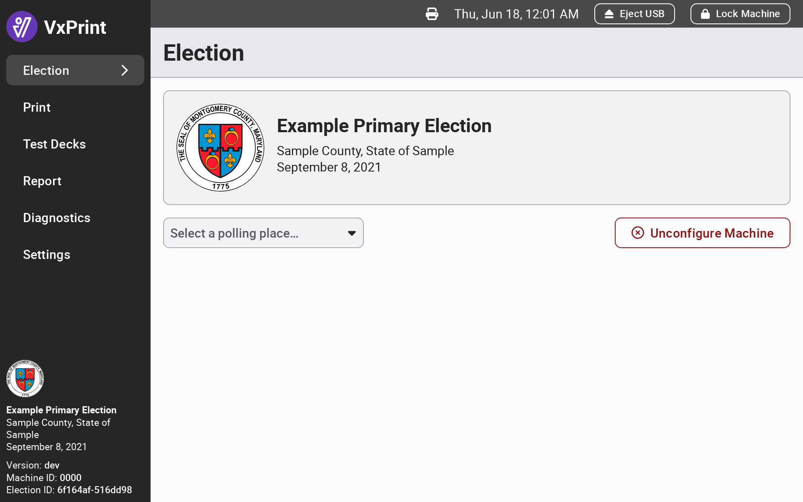
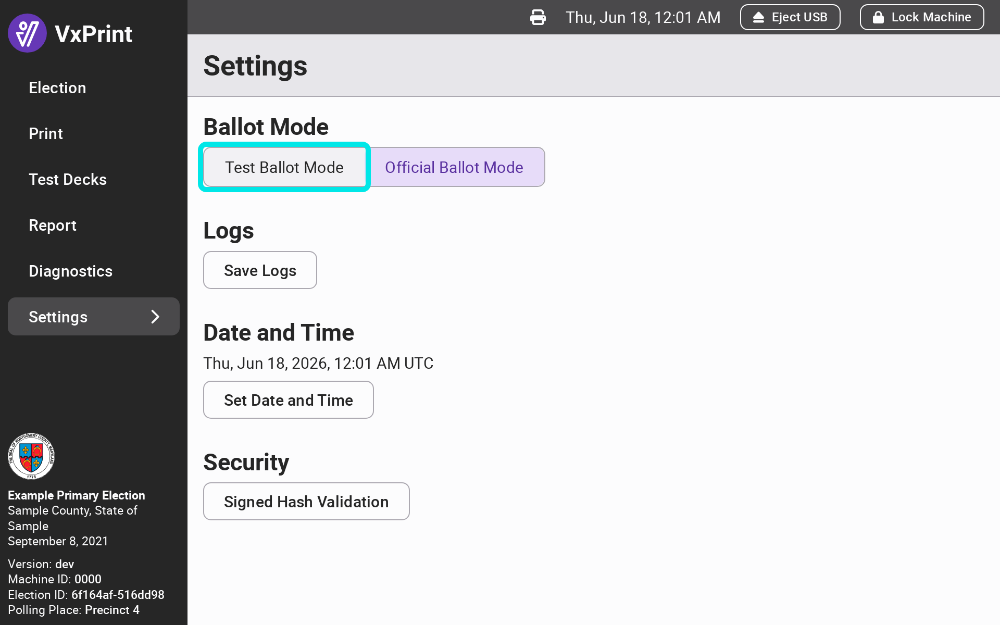
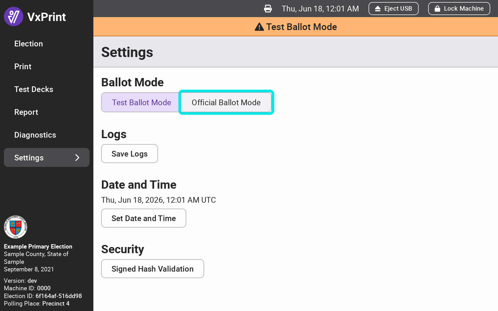
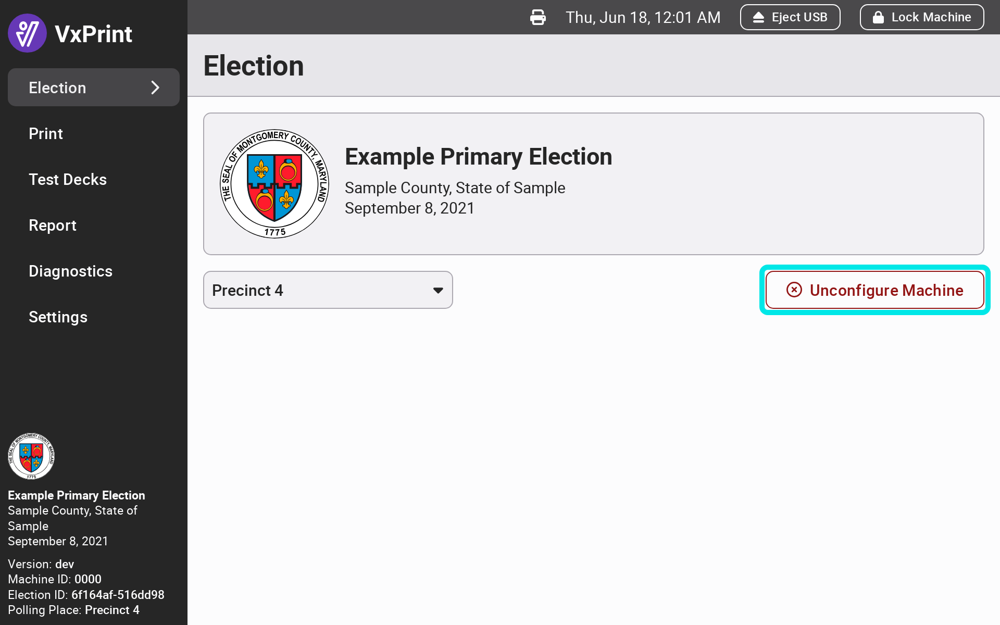
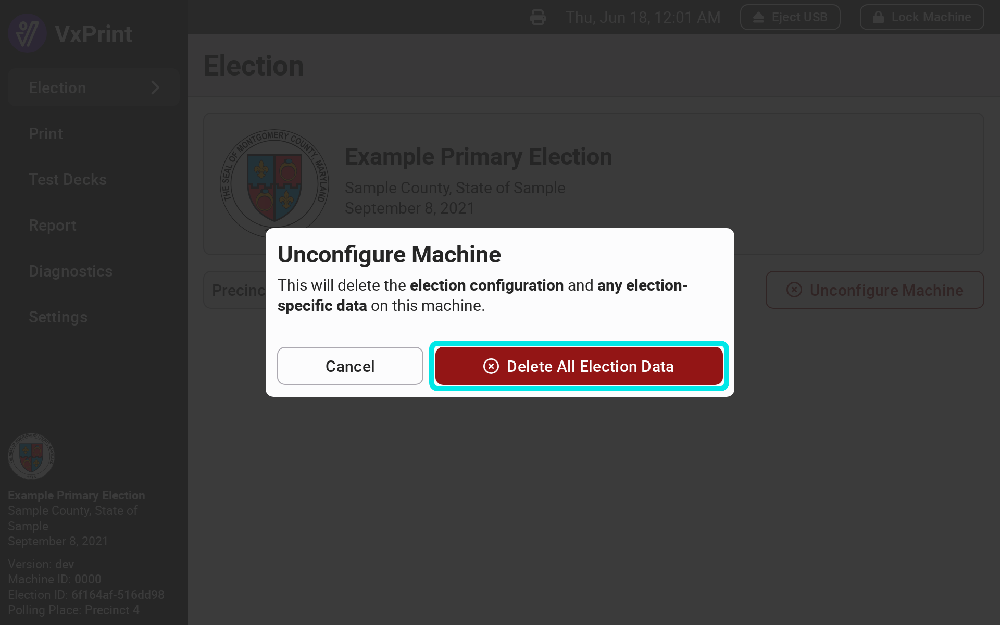
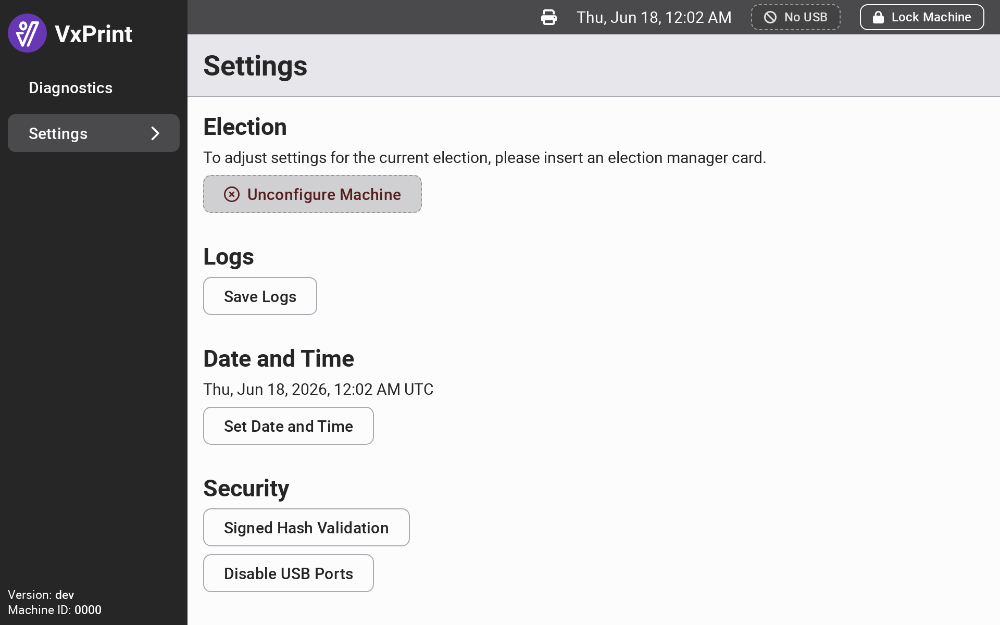

# Configure VxPrint


The following steps must be completed by an election manager. You may configure VxPrint without the printer unpacked and set up.


To configure **VxPrint**, you must do two things in **VxAdmin**:

1. [Save the election package](../vxadmin-system-setup/save-election-package.md "mention") to a USB drive
2. [Create an election manager card](../vxadmin-system-setup/programming-cards.md "mention")

## Inserting Smart Cards

The smart card reader is located on the side of the laptop to the left of the trackpad. Insert a smart card with the chip facing up.

<figure><figcaption></figcaption></figure>

The picture above shows someone inserting a system administrator card into the laptop. To configure VxPrint, you will need to insert an election manager card.

## Loading The Election Package

After logging in with an election manager card, VxPrint will prompt you to insert a USB drive with the election package saved from VxAdmin.&#x20;

After the USB drive is inserted, VxPrint will automatically begin loading all ballot styles for the election. After the election package is done loading, the election information will appear.

<figure><figcaption></figcaption></figure> <figure><figcaption></figcaption></figure> <figure><figcaption></figcaption></figure>

## Select a Polling Place

If the election has more than one polling place, an election manager must select one before VxPrint can print ballots. Until a polling place is selected, VxPrint prompts you to insert an election manager card to select a polling place. From the `Election` screen, use the `Select a Polling Place...` dropdown to choose the polling place for the device.

The selected polling place limits which ballot styles poll workers can print. Election managers can always print any ballot style.

<figure><figcaption></figcaption></figure>


If your election package defines only one polling place, it is selected automatically and the `Select a Polling Place...` dropdown will not be visible.&#x20;


## Changing Ballot Mode

By default, VxPrint is in `Official Ballot Mode` and all ballots printed will be official ballots. If you intend to use VxPrint for testing with the rest of the voting system, navigate to the `Settings` page and use the toggle button to switch to `Test Ballot Mode` . In `Test Ballot Mode`, all ballots printed will be test ballots and a `Test Ballot Mode` banner will display in the top bar at all times.&#x20;

<figure><figcaption></figcaption></figure> <figure><figcaption></figcaption></figure>

Switching ballot modes will clear the ballot printed counts.


Remember to switch VxPrint back to `Official Ballot Mode` after logic and accuracy testing is complete!


## Removing Configuration & Election Data

To remove election configuration (and all data) from VxPrint:

* [ ] Log in with an election manager card
* [ ] Select `Unconfigure Machine`
* [ ] Confirm by selecting `Delete All Election Data`&#x20;

<figure><figcaption></figcaption></figure> <figure><figcaption></figcaption></figure>

You can now re-configure VxPrint with a different election package.


The system administrator card also can be used to unconfigure a machine, which may be useful if the election manager card for a previous election is no longer available.


### System Administrator Settings 

The system administrator can always access the `Settings` page, regardless of the election that VxPrint is configured for or whether VxPrint is configured at all. The system administrator has the same `Settings` functionality as the election manager: saving logs, setting the date and time, and verifying the integrity of the software via `Signed Hash Validation`. The system administrator can always unconfigure the election. This is especially useful in the case where VxPrint is configured for a previous election but election manager cards programmed for the previous election are no longer available.

<figure><figcaption></figcaption></figure>
