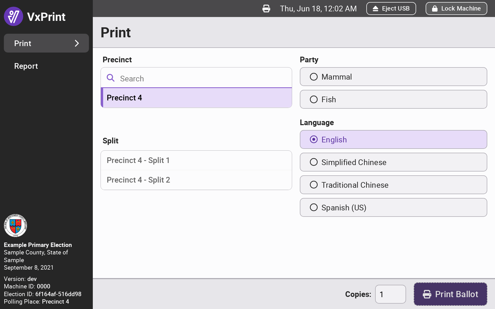
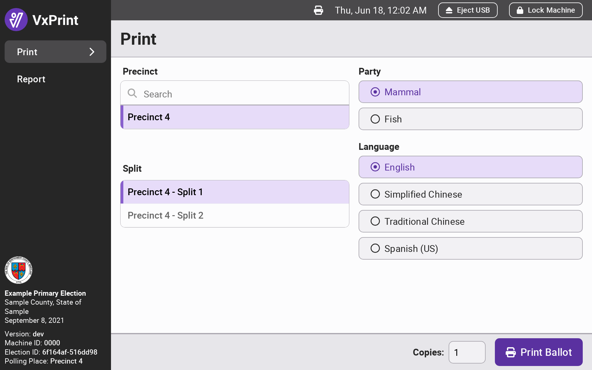
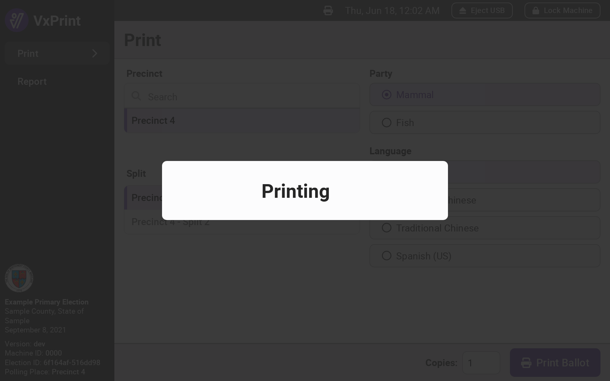
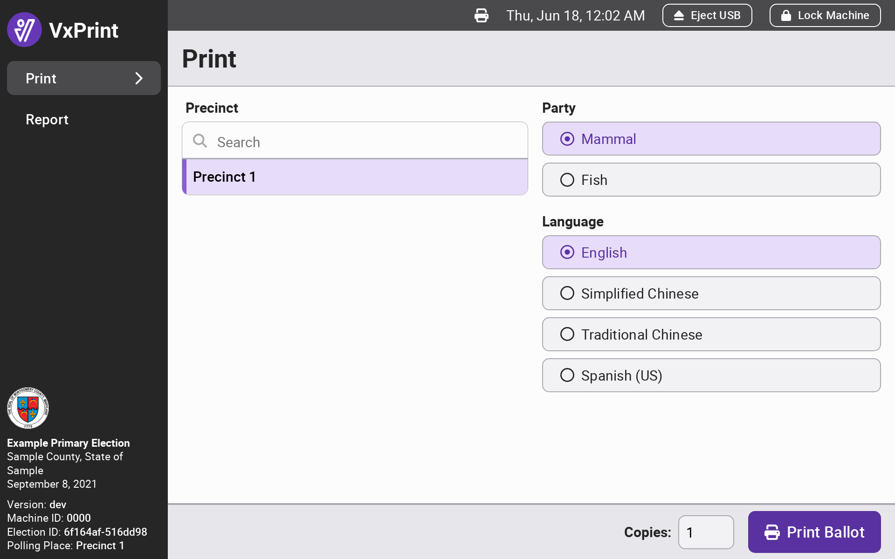
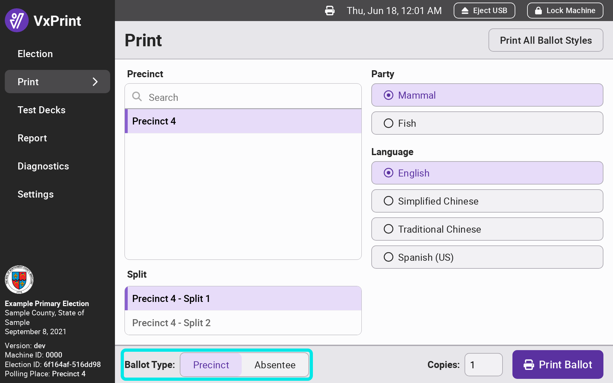
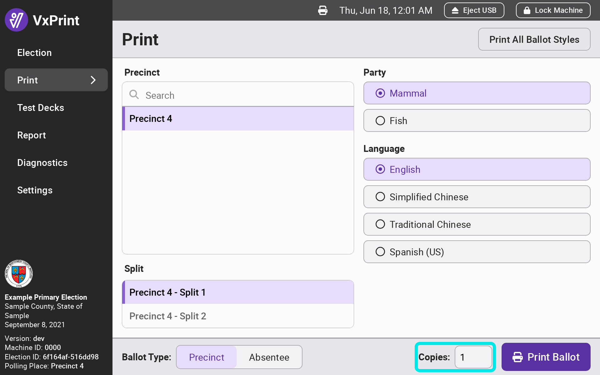

# Printing Ballots

## Printing Ballots: The Basics

For both poll workers and election managers, ballots are printed from the `Print` page. The user selects the attributes of the ballot they want to print and then click `Print Ballot`:

1. Select the precinct
2. Select the precinct split (applicable only to precincts with splits)
3. Select the party (applicable only to primaries)
4. Change the language if necessary (applicable only to multi-language ballot styles)
5. Click `Print Ballot`

<figure><figcaption></figcaption></figure> <figure><figcaption></figcaption></figure> <figure><figcaption></figcaption></figure>

The options will vary depending on the jurisdiction, election, and configuration. If the election manager has configured VxPrint for a specific precinct, the poll worker's options will be limited to ballot styles for that precinct:

<figure><figcaption></figcaption></figure>

## Printing Ballots: Election Manager Options

Election managers have a few additional options for printing. Regardless of how VxPrint is configured, election managers are always able to print ballot styles for any precinct. They are also able to print absentee ballots and print multiple ballot copies at once:

<figure><figcaption></figcaption></figure> <figure><figcaption></figcaption></figure>

Election managers may also print all ballot styles at once, instead of printing ballot styles one at a time. Click the `Print All Ballot Styles` button, select the options for the ballot styles you want to print, and click `Print X Ballot Styles`:

<figure><figcaption></figcaption></figure> <figure><figcaption></figcaption></figure>

