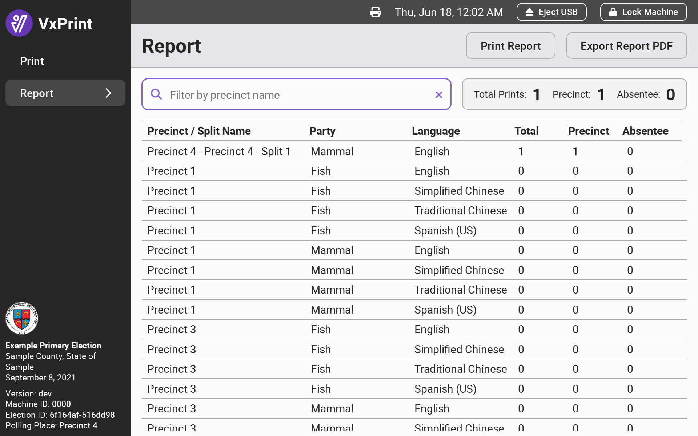
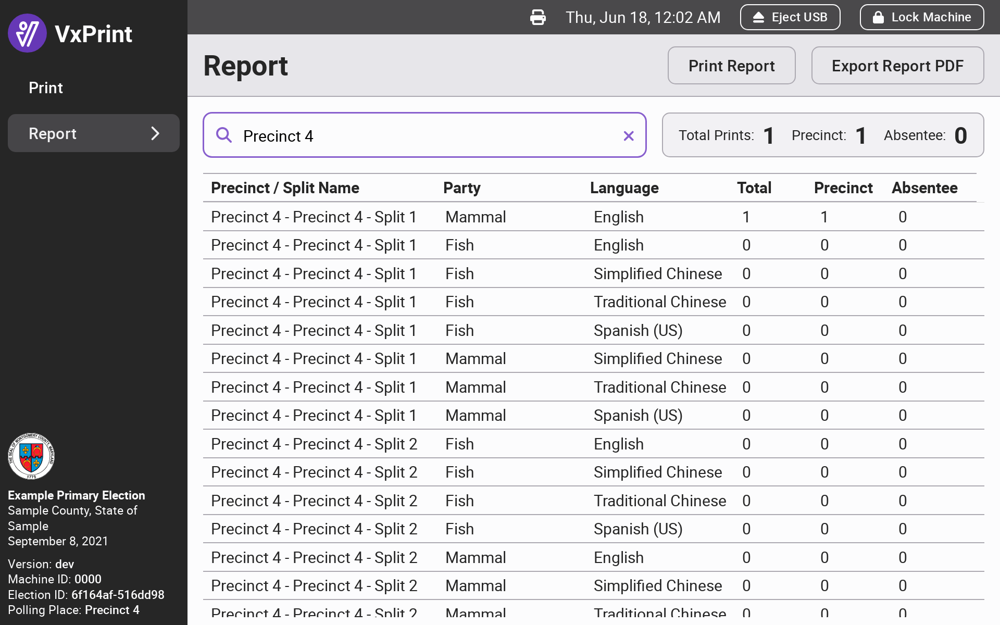
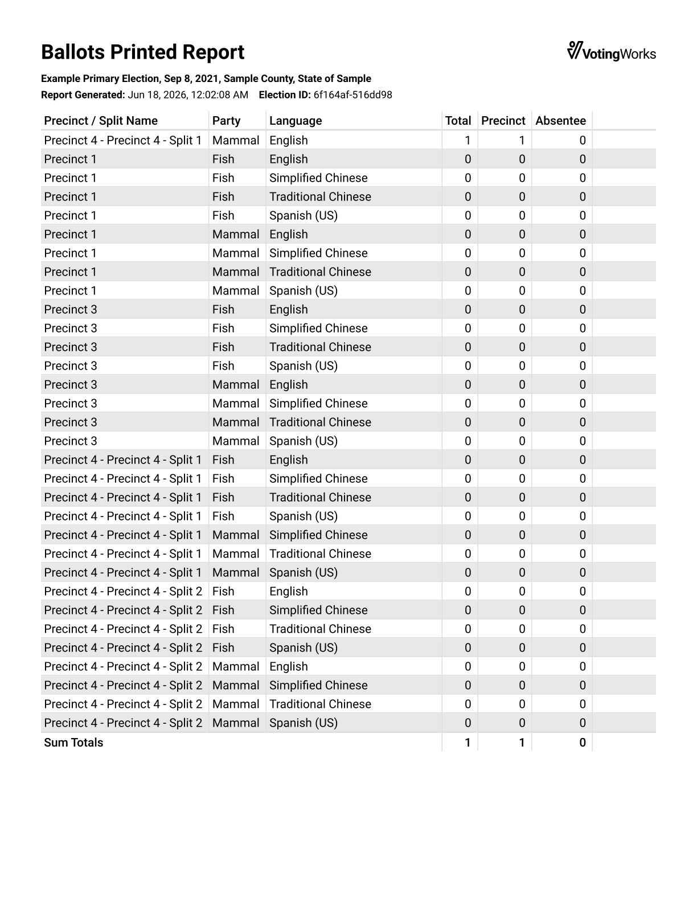

# Reporting & Logs

### Reporting

Election managers and poll workers can view the number of ballots printed on the `Report` page. The page lists the number of precinct, absentee, and total ballots printed for each ballot style. You may use the search bar to narrow down the list to certain precincts or precinct splits:

<figure><figcaption></figcaption></figure> <figure><figcaption></figcaption></figure>

The report can be printed with the `Print Report` button or exported to a USB drive with the `Export Report PDF` button.

<figure><figcaption></figcaption></figure>

### Saving Logs 

In order to save logs, navigate to the `Settings` page and click `Save Logs`. Insert a USB drive. VotingWorks recommends the `Default` format unless instructed otherwise. Click `Save` and the logs will be exported to the USB drive.

<figure><figcaption></figcaption></figure> <figure><figcaption></figcaption></figure>

