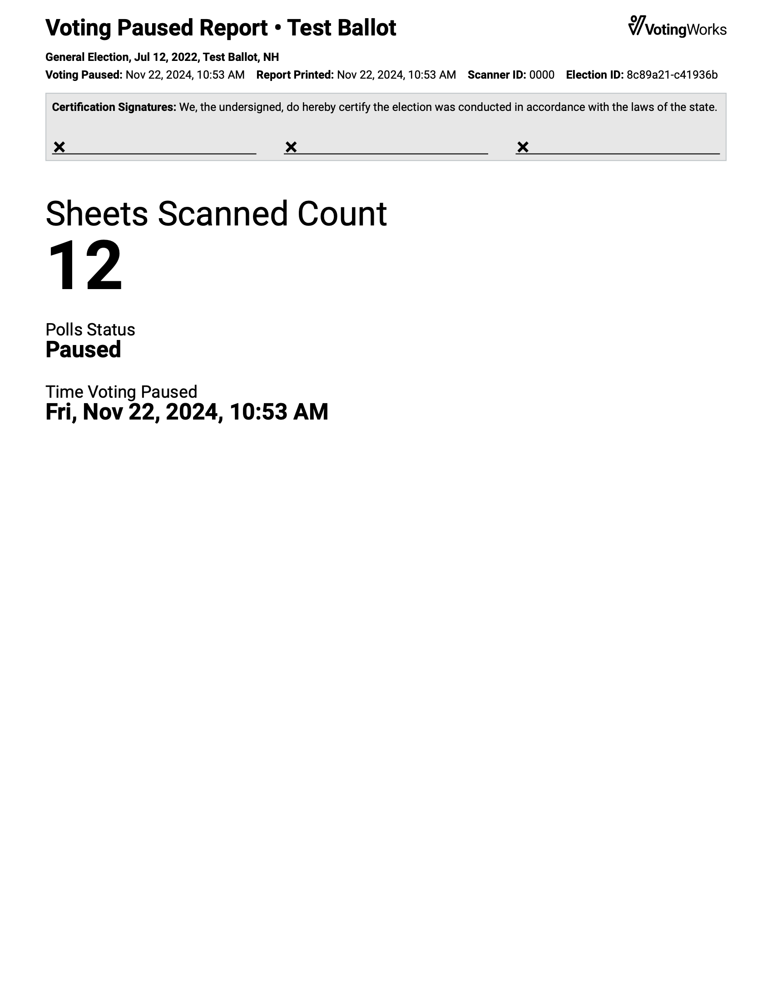
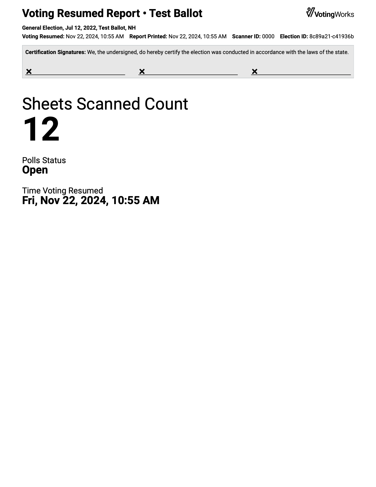

# Additional Poll Worker Actions


The following steps must be completed by a poll worker.


### Pause or Resume Voting

The _`Pause Voting`_ action in the poll worker screen is generally used by jurisdictions conducting early voting over multiple days or during an emergency situation. To pause voting and prevent ballots from being cast at VxScan:

* [ ] insert a poll worker card and select _`Menu`_
* [ ] select _`Pause Voting`_

<figure><figcaption></figcaption></figure> <figure><figcaption></figcaption></figure>

* [ ] select _`Reprint Voting Paused Report`_ to print more reports as necessary
* [ ] remove the poll worker card

<figure><figcaption></figcaption></figure> <figure><figcaption></figcaption></figure>

Voting is now paused. To later resume voting:

* [ ] insert a poll worker card and select _`Resume Voting`_

<figure><figcaption></figcaption></figure>

One copy of the voting resumed report will print. If additional reports are needed, select _`Reprint Voting Resumed Report`_ to print more. The voting resumed report and the voting paused report should have the same ballots scanned count.

* [ ] remove the poll worker card

<figure><figcaption></figcaption></figure>

The polls are now open. Below are examples of the voting paused report and voting resumed report.

<figure><figcaption></figcaption></figure> <figure><figcaption></figcaption></figure>

### Printing Previous Reports

If additional copies of a report need to be printed at any time, insert a poll worker card and select _`Menu`_ to access the poll worker menu. Select _`Print xxx Report`_ to print additional copies.

<figure><figcaption></figcaption></figure> <figure><figcaption></figcaption></figure>

### Hash Validation

VotingWorks equipment provides additional system security by allowing you to confirm the software is the same as the certified version. To confirm on VxScan, insert a Poll Worker Card, select _`No`_, and select _`Hash Validation`_. Then navigate to check.voting.works on your phone and scan the QR code on the VxScan. The site will validate the QR code data and verify the software is the same as the certified version.

<figure><figcaption>
select Hash Validation
</figcaption></figure> <figure><figcaption>
validate at check.voting.works
</figcaption></figure>


If the hash is not validated at check.voting.works contact your election administrator immediately.

