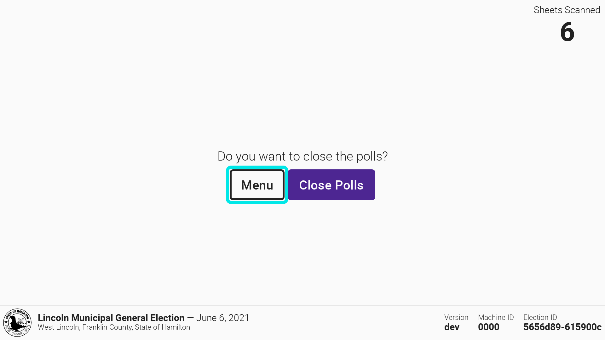
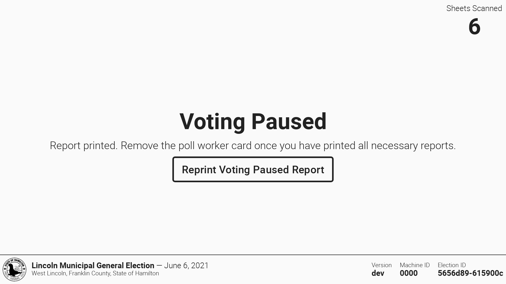
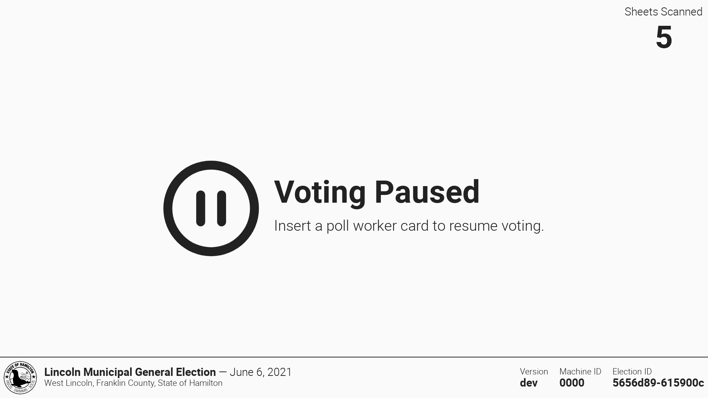
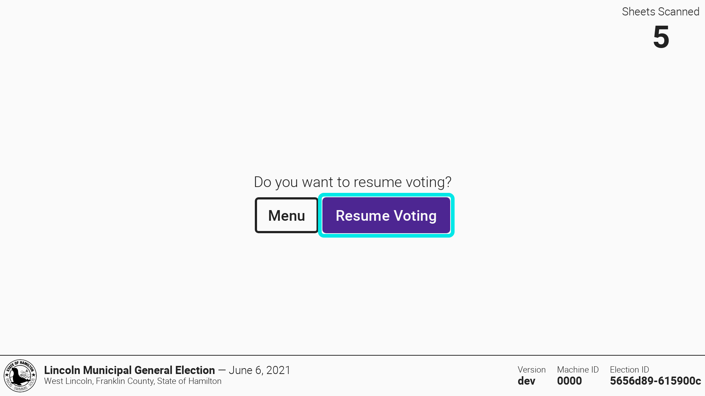
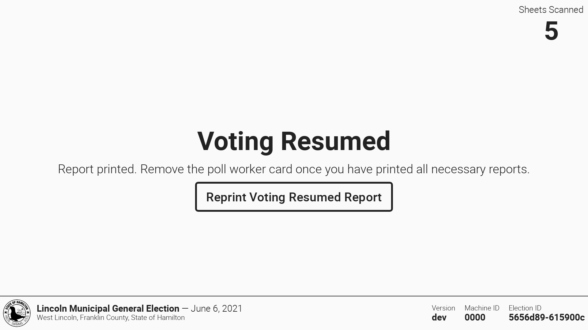
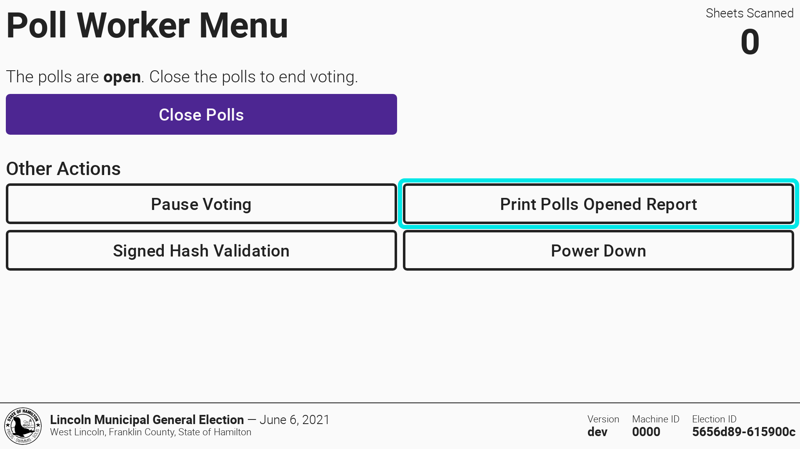
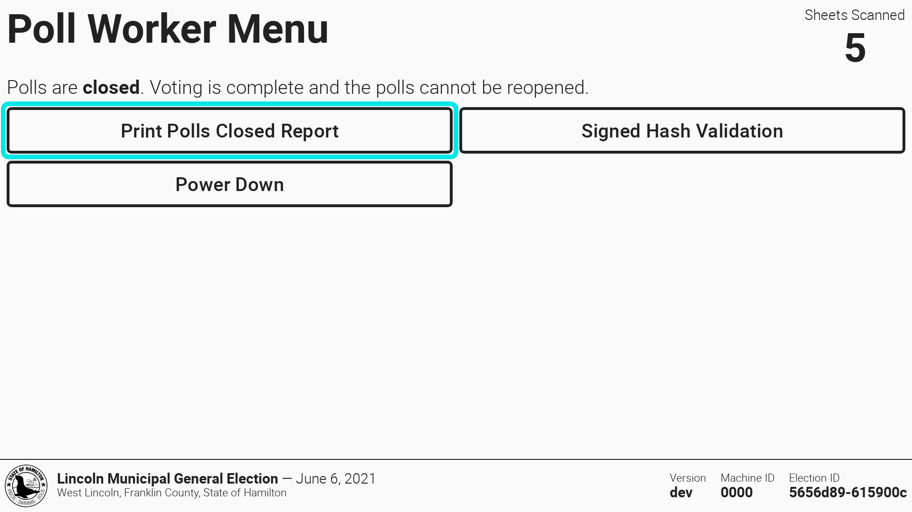
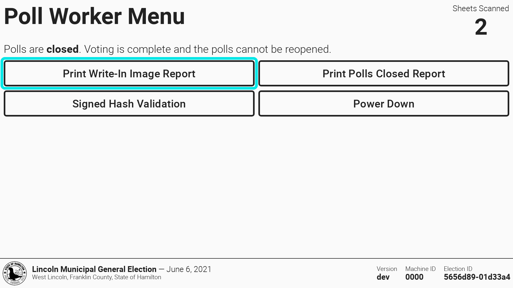
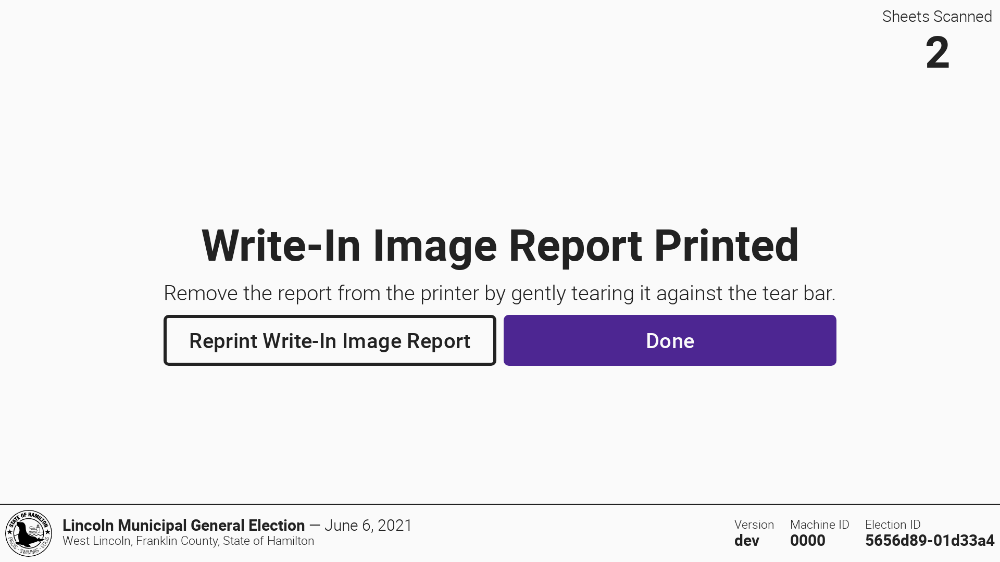

# Additional Poll Worker Actions


The following steps must be completed by a poll worker.


## Pause or Resume Voting

The `Pause Voting` action in the poll worker screen is generally used by jurisdictions conducting early voting over multiple days or during an emergency situation. To pause voting and prevent ballots from being cast at VxScan:

* [ ] Insert a poll worker card and select `Menu`
* [ ] Select `Pause Voting`

<figure><figcaption></figcaption></figure> <figure><figcaption></figcaption></figure>

* [ ] Select `Reprint Voting Paused Report` to print more reports as necessary
* [ ] Remove the poll worker card

<figure><figcaption></figcaption></figure> <figure><figcaption></figcaption></figure>

Voting is now paused. To resume voting:

* [ ] Insert a poll worker card and select `Resume Voting`

<figure><figcaption></figcaption></figure> <figure><figcaption></figcaption></figure>

* [ ] Select `Reprint Voting Resumed Report` to print more reports as necessary&#x20;
* [ ] Remove the poll worker card

The polls are now open.

## Printing Previous Reports

If additional copies of a report need to be printed at any time, insert a poll worker card and select `Menu` to access the poll worker menu. Select `Print [ Type] Report` to print additional copies.

<figure><figcaption></figcaption></figure> <figure><figcaption></figcaption></figure>

Additional reports can only be printed as long as no ballots have been scanned since the original report was printed.

## Printing Write-In Image Reports

If your jurisdiction enables write-in image reports on VxScan, you will see the option to `Print Write-In Image Report` after polls are closed. Select `Print Write-In Image Report` and print additional copies as needed.

<figure><figcaption></figcaption></figure> <figure><figcaption></figcaption></figure>

