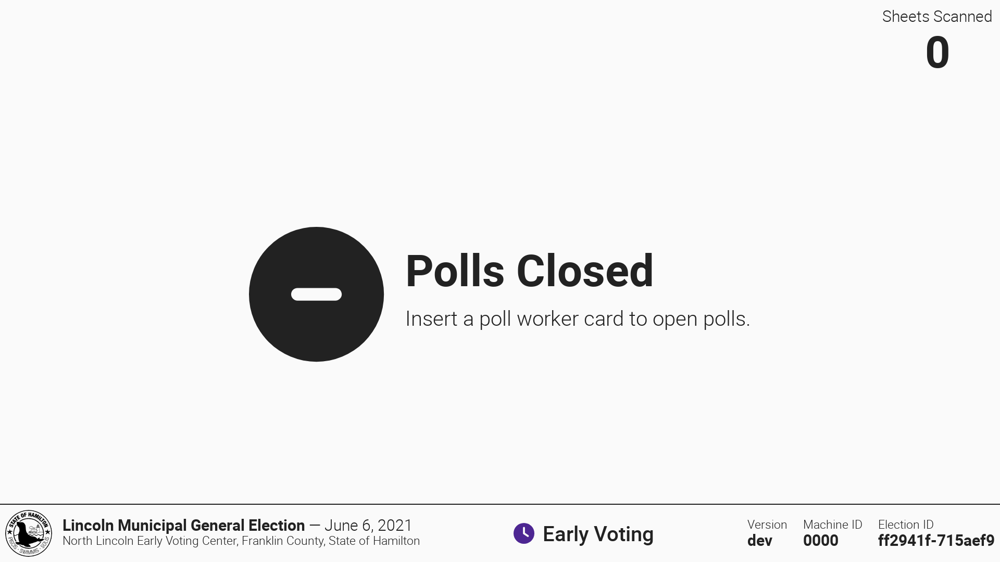
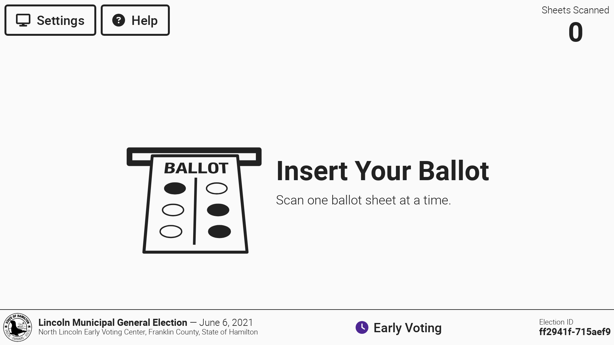
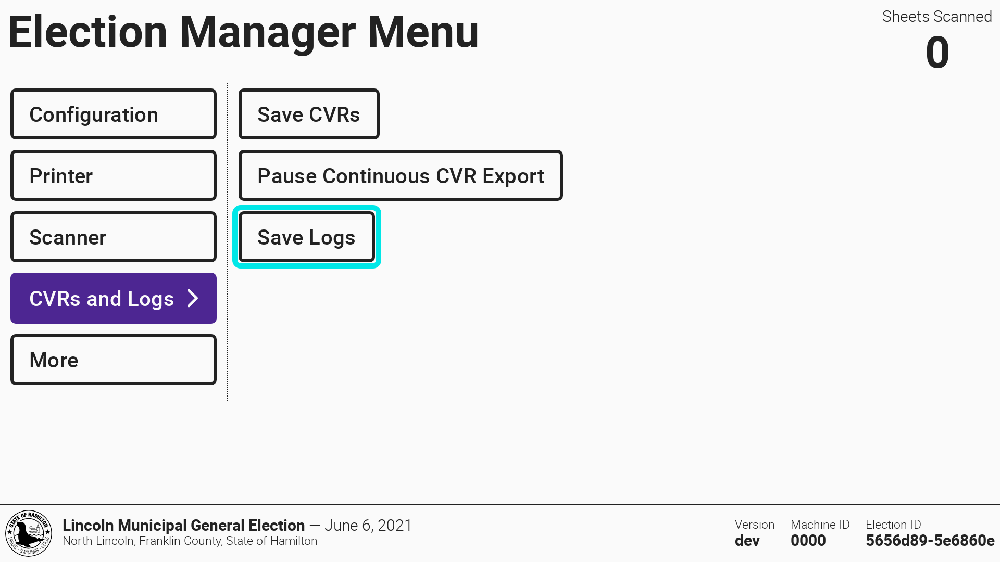
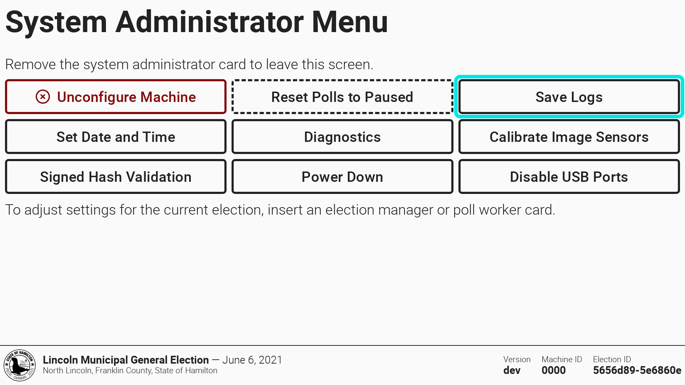
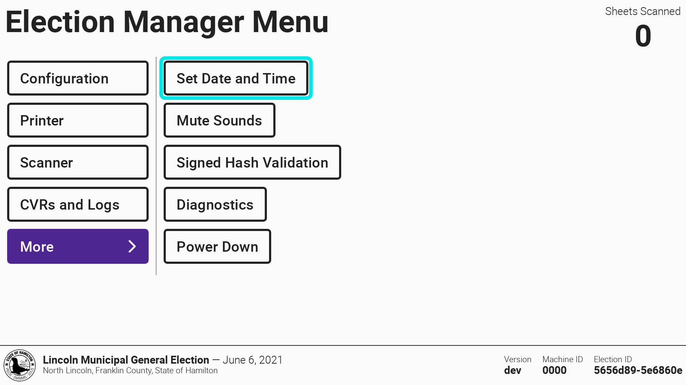
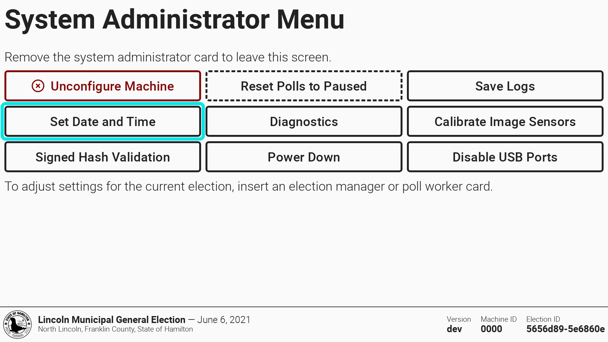

# Additional VxScan Settings

## Early Voting Mode

Before using VxScan for early voting, an election should put it into Early Voting mode.

<figure><figcaption></figcaption></figure>

While in early voting mode, an "Early Voting" status will always be displayed on the bottom of the screen.

<figure><figcaption></figcaption></figure> <figure><figcaption></figcaption></figure>

The default action for poll workers in early voting mode is `Pause Voting` rather than `Close Polls`. Poll workers should `Pause Voting` at the end of each voting day and `Resume Voting` at the beginning of each voting day.

<figure><figcaption></figcaption></figure>

## Saving CVRs

The cast vote records contain the images and the interpretation for each ballot cast and is used to tally votes in VxAdmin. The cast vote record saves continuously to the USB drive throughout the day and again at the close of polls. If another copy is needed, however, it can also be saved by selecting `CVRs and Logs` from the side menu and selecting `Save CVRs`.

<figure><figcaption></figcaption></figure>

The `Pause Continuous CVR Export` feature is used to disable continuous cast vote record export in the case that a USB drive fails or is unavailable. When continuous export is paused, VxScan can be used without an inserted USB drive and CVRs must be manually exported from the election manager menu after polls are closed. If you experience USB drive issues, contact customer support. This setting should only be used if advised by the VotingWorks support team.

## Saving Logs

The logs contain information about the regular operation of the hardware and software and also any error messages. Both election managers and system administrators can export logs by selecting `Save Logs` .

<figure><figcaption></figcaption></figure> <figure><figcaption></figcaption></figure> <figure><figcaption></figcaption></figure>

## Setting Date & Time

The time on VxScan should stay mostly accurate, including automatically adjusting for daylight savings time, but can drift slightly over time. Both election managers and system administrators can update the time by selecting `Set Date and Time`.

<figure><figcaption></figcaption></figure> <figure><figcaption></figcaption></figure> <figure><figcaption></figcaption></figure>

## Muting Sounds


The following step can only be completed by an election manager.


VxScan makes sounds every time a ballot is accepted or rejected. Sounds can be muted and unmuted by an election manager.

<figure><figcaption></figcaption></figure>

## Resetting Polls to Paused


The following step can only be completed by a system administrator.


If polls have been closed accidentally by a poll worker, a system administrator may reset the polls to paused, after which a poll worker can resume voting.

<figure><figcaption></figcaption></figure>
