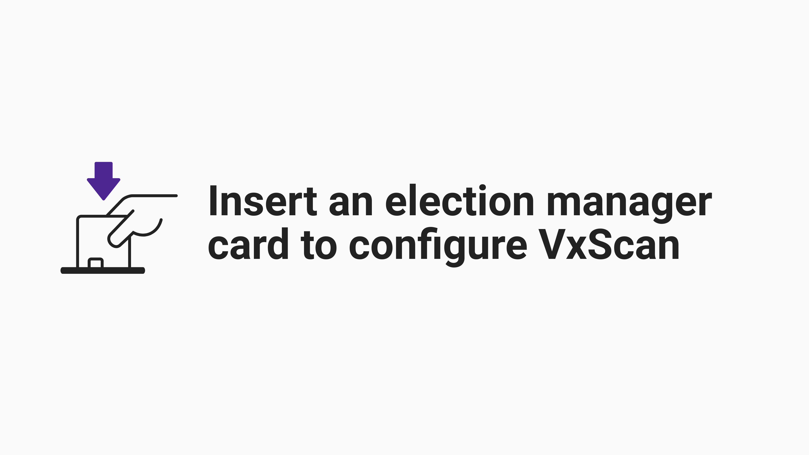
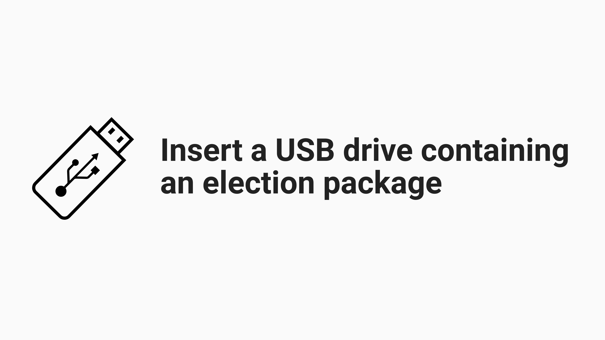
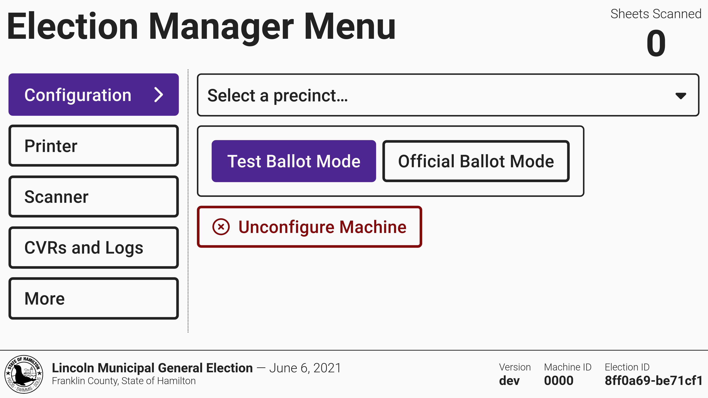
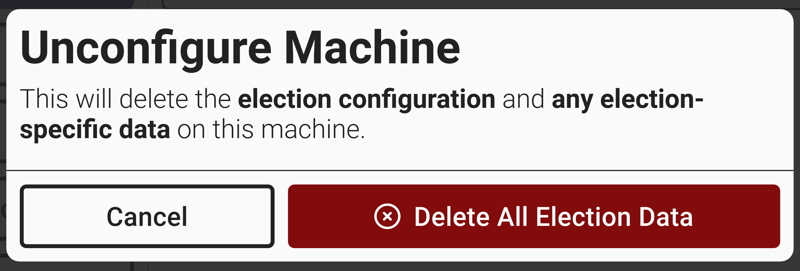
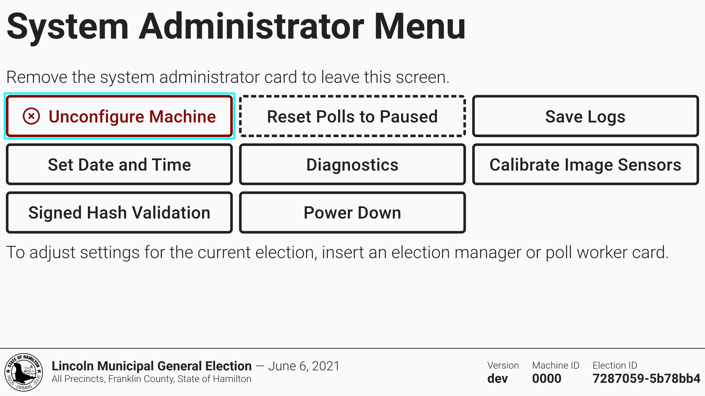

# Configure VxScan


The following steps must be completed by an election manager.


Before you configure VxScan, set up the machine with the [vxscan-setup.md](../election-day-guides/vxscan-setup.md "mention") guide.

To configure **VxScan**, you must do two things in **VxAdmin**:

1. [Save the election package](../vxadmin-system-setup/save-election-package.md) to a USB drive
2. [Create an election manager card](../vxadmin-system-setup/programming-cards.md)

## Loading The Election Package

An unconfigured machine will prompt you to insert an election manager card to log in and then insert a USB drive with the election package saved from VxAdmin.&#x20;

<figure><figcaption></figcaption></figure> <figure><figcaption></figcaption></figure>


Only one USB drive should be plugged into VxScan at a time. The other USB port is designed as a backup in the event of a failure.


After you insert the USB drive, VxScan will automatically begin loading all ballot styles for the election. After the election package is done loading, the election manager menu will be displayed and VxScan will be in test ballot mode.

<figure><figcaption></figcaption></figure>

Jurisdictions with more than one precinct must select the precinct for the device.&#x20;

## Setting Ballot Mode

Use the toggle button to switch between _`Test Ballot Mode`_ and _`Official Ballot Mode`_. The machine must be in official ballot mode on election day.  Review the [l-and-a-overview.md](../logic-and-accuracy-pre-election-testing/l-and-a-overview.md "mention") instructions to understand which mode to use during L\&A testing.

<figure><figcaption></figcaption></figure>

## Removing Election Configuration

There are two ways to remove the election configuration and all scanned ballot data.&#x20;

**Removing Election Configuration - Election Manager**

* [ ] Insert an election manager card
* [ ] Select _`Unconfigure Machine`_

<figure><figcaption></figcaption></figure>

* [ ] Confirm by selecting _`Delete All Election Data.`_

<figure><figcaption></figcaption></figure>

You can now configure VxScan with a different election package.

**Removing Election Configuration - System Administrator**

* [ ] Insert a system administrator card
* [ ] Select _`Unconfigure Machine`_

<figure><figcaption></figcaption></figure>

* [ ] Confirm by selecting _`Delete All Election Data.`_

<figure><figcaption></figcaption></figure>

You can now configure VxScan with a different election package.
