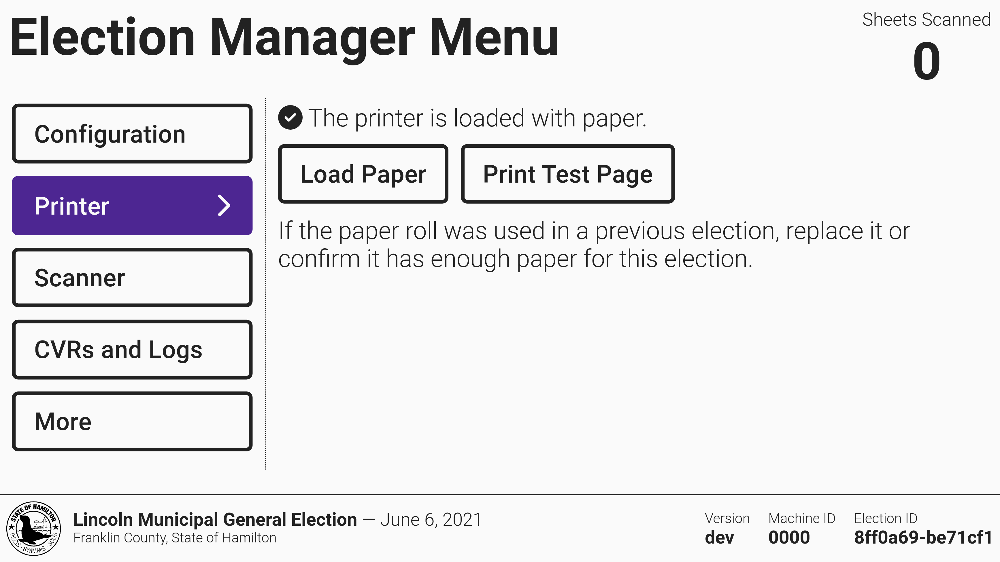
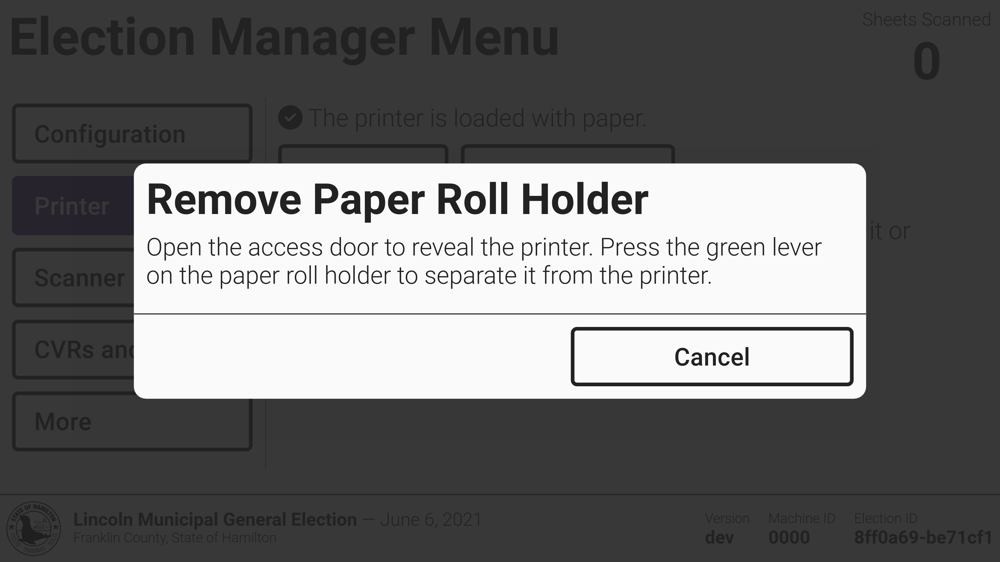
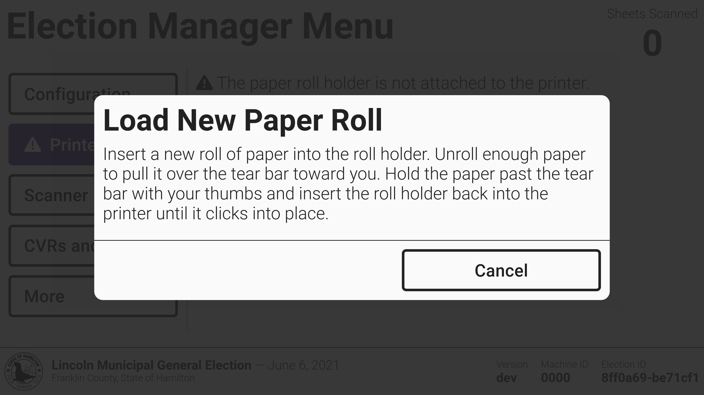
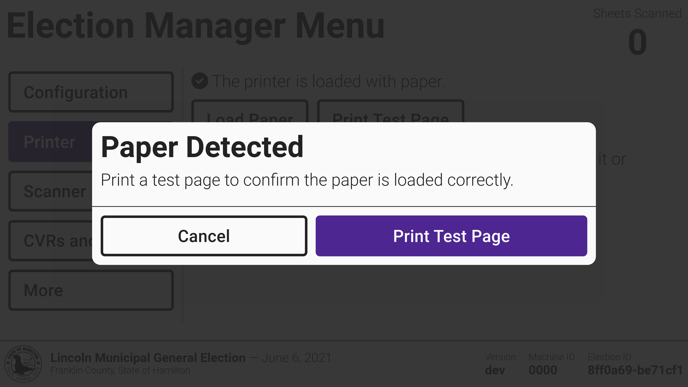

# Printer Management

To replace a paper roll or print a test page, select Printer from the side menu and select _`Load Paper`_ or _`Print Test Page`_.&#x20;

<figure><figcaption></figcaption></figure>

If loading a new paper roll, the screen will walk you through removing the paper roll holder and loading a new paper roll. Select _`Print Test Page`_ to print a test page and confirm the paper was loaded properly.

<figure><figcaption></figcaption></figure> <figure><figcaption></figcaption></figure> <figure><figcaption></figcaption></figure>


The paper roll can be replaced at any point of time, with the machine turned on or off.  Using the election manager printer flow is not required but can be helpful for someone who needs step-by-step instructions or wants to print a test page.


To replace or add a printer paper roll:

* [ ] open the poll worker door
* [ ] open the access door
* [ ] push the green button on the right side of the paper roll case
* [ ] remove the paper roll holder

<figure><figcaption>
open panels
</figcaption></figure> <figure><figcaption>
push the green button
</figcaption></figure> <figure><figcaption>
remove the paper roll case
</figcaption></figure>


The paper roll must be installed in the correct orientation or it will not print. The correct orientation is indicated on the side of the paper roll holder.


* [ ] place one end of the paper roll on the paper roll holder
* [ ] snap the other end of the paper roll onto the paper roll holder
* [ ] pull a small amount of paper up and over the tear bar

<figure><figcaption>
place one end on the case
</figcaption></figure> <figure><figcaption>
place the other end on the case
</figcaption></figure> <figure><figcaption>
pull paper through the feed
</figcaption></figure>

* [ ] snap the paper roll holder back into VxScan
* [ ] remove excess paper by pulling toward you and tearing

<figure><figcaption>
snap case back in to VxScan
</figcaption></figure> <figure><figcaption>
remove excess paper
</figcaption></figure>

* [ ] close the access door
* [ ] close the poll worker door
