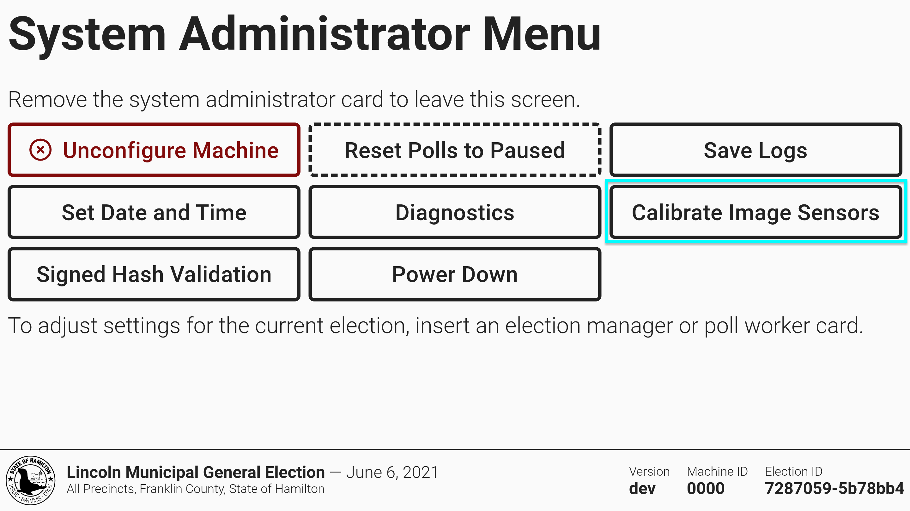

# Scanner Management

VotingWorks recommends that someone cleans the scanner and calibrates double sheet detection before every election.

## Scanner Cleaning

The scanner must be clean to accurately detect marks on ballots. In order to clean the scanner:

* [ ] Open the poll worker door
* [ ] Open the access door
* [ ] Open the scanner

<figure><figcaption>
Poll worker door closed
</figcaption></figure> <figure><figcaption>
Poll worker door open
</figcaption></figure>

<figure><figcaption>
Access door open
</figcaption></figure> <figure><figcaption>
Scanner open
</figcaption></figure>

Once the scanner is open, you can use cleaning fluid and a microfiber or lint-free cloth to clean the scanner. Dampen the cloth and rub with moderate force on the scanning glass and the rollers:

* [ ] Clean upper glass
* [ ] Clean lower glass
* [ ] Clean upper rollers
* [ ] Clean lower rollers

<figure><figcaption>
Cleaning the scanner
</figcaption></figure>

After cleaning, simply close the following:

* [ ] Close scanner
* [ ] Close access door
* [ ] Close poll worker door

To confirm the scanner is clean and producing clear images, you may either run the [scanner diagnostic](vxscan-diagnostics.md) or simply start scanning - if streaks are detected in the images, the software will alert the user.

## Double Sheet Detection


The following steps can only be completed by an election manager.


In order to prevent voters attempting to scan two ballots at once, VxScan has a double sheet detection feature. To manage double sheet detection, navigate to the _`Scanner`_ tab of the election manager menu.

<figure><figcaption></figcaption></figure>

Select _`Calibrate Double Sheet Detection`_ to begin calibration. Follow the instructions on screen. You will need two sheets of blank paper that have the same paper weight as the ballots for the election.

The _`Disable Double Sheet Detection`_ feature is used to disable the ultrasonic sensor in the event that it fails and improperly rejects single sheets as multiple sheets. If VxScan stops taking ballots or repeatedly displays the _Ballot Not Counted - Multiple sheets detected_ error message, contact customer support. This setting should only be used if advised by the VotingWorks support team.

## Image Sensor Calibration


The following step can only be completed by a system administrator.


Image sensor calibration is recommended as part of [regular long-term maintenance](../system-maintenance/vxscan-maintenance-manual.md#long-term-hardware-maintenance) every 100k scans or every 3 years.  Under exceedingly rare circumstances, one may need to calibrate the scanner image sensors more often.  In this calibration, the scanner reads a blank white sheet of paper to ensure proper conversion from physical paper to digital image.&#x20;

<figure><figcaption></figcaption></figure>

Machines are shipped with this calibration having already been completed by the part manufacturer, and it may never have to be performed outside the regular long-term maintenance. It should only be performed during L\&A if ballots _consistently_ fail to scan with generic errors unrelated to election configuration (e.g., "Ballot Scan Failed - There was a problem scanning your ballot. Please scan it again."), all other reasons for failure (e.g., ballots not printed to spec) have been ruled out, and VotingWorks support has suggested this as a course of action.
