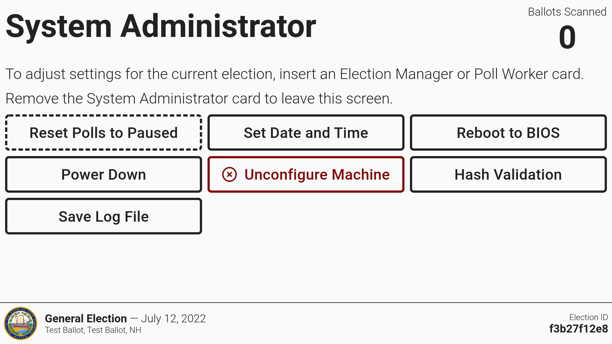

# System Administrator Functions

A few functions in VxScan are limited to System Administrators and only appear in a menu with use of a System Administrator Card.

**Reset Polls to Paused** - use the _`Reset Polls to Paused`_ function to reopen the polls. This function is most often used as a result of a poll worker error.

**Set Date & Time** - use _`Set Date & Time`_ to change the date and time.

**Reboot to BIOS** - this function is reserved for VotingWorks support staff to boot the machine into the BIOS setup screen for firmware configuration.

<figure><figcaption></figcaption></figure>

**Power Down** - select to turn off the VxScan.

**Unconfigure Machine** - select _`Unconfigure Machine`_ to delete all data and the election configuration.

**Hash Validation** - select _`Hash Validation`_ and navigate to check.voting.works on your phone and scan the QR code on the VxScan. The site will validate the QR code data and verify the software is the same as the certified version.

**Save Log File** - select _`Save Log File`_ to save the full log of VxScan activity to the /logs folder on the inserted USB drive.
