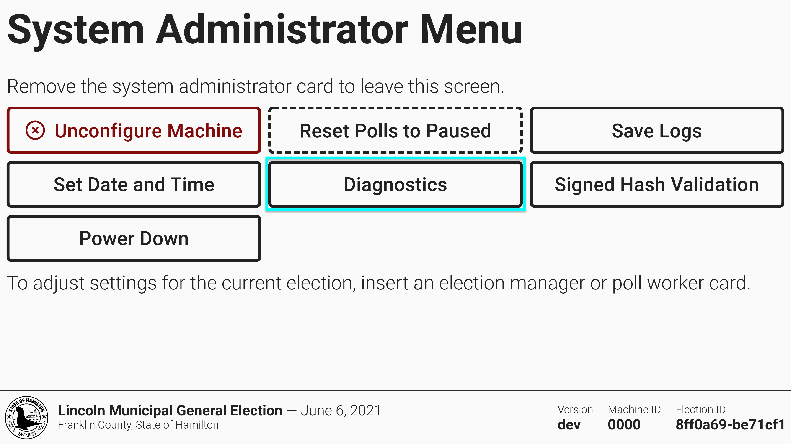
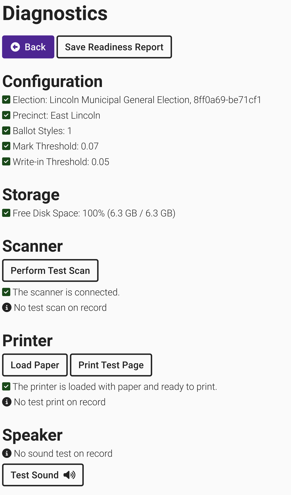

# VxScan Diagnostics

The diagnostics interface is used to test hardware before or between elections and monitor the status of the machine. It is accessible from both the election manager and system administrator menus.

<figure><figcaption></figcaption></figure> <figure><figcaption></figcaption></figure>

The VxScan diagnostics screen shows information about how the machine is configured, how much storage is left on the device, and the current status of the scanner and printer. Prior to each election, walk through each test to verify each component is in working order. During normal operations, if one of the components fails, VxScan will display an error message on screen.&#x20;

Select _`Perform Test Scan`_ and insert a blank sheet of paper as prompted. This test verifies the scanner is clean and ballot images are clear.  If the test fails, you'll be prompted to clean the scanner. The test will also fail if the sheet is not blank.&#x20;

Select _`Print Test Page`_ to ensure the paper roll is installed properly. If the paper roll was installed backwards, nothing will print. After the test print completes, you must indicate whether the print was successful or not.

Select _`Test Sound`_ to verify the speaker is working properly.&#x20;

The most recent test result for each piece of hardware is shown on the diagnostics screen and included in the readiness report.

<figure><figcaption></figcaption></figure>

The readiness report can be used as a record of system diagnostic verification.  Select _`Save Readiness Report`_ to save a copy to a USB drive.&#x20;

<figure><figcaption>
Example VxScan Readiness Report
</figcaption></figure>

